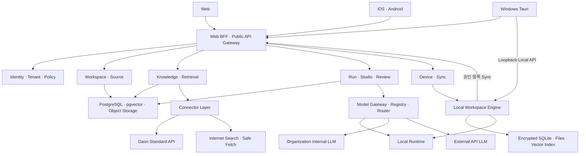

# Daon 사용자형 지식 업무지원 프로그램 상세 설계서

## 문서 정보

| 항목 | 내용 |
| --- | --- |
| 문서 구분 | 독립 제품 상세 설계 정본 |
| 문서 버전 | 0.7 |
| 작성일 | 2026-07-20 |
| 개정 | 2026-07-20 · ysna-server 격리 개발·통합 배포 기준 반영 |
| 상태 | 승인 · 신산님 · 2026-07-20 |
| 승인 기록 | `APR-G0-DESIGN-20260720-01` |
| 대상 제품 | Daon 사용자형 지식 업무지원 프로그램 |
| 제품 관계 | Daon2, Daon2.5, Daon3과 별개의 독립 제품 |
| 정본 | 이 Markdown 문서 |
| 배포본 | `docs/Daon 사용자형 지식 업무지원 프로그램 상세 설계서.docx` |

## 0. 설계 기준

### 기준 자료

| Source ID | 저장소 기준 위치·URL | 지위와 적용 범위 | Digest 관리 |
| --- | --- | --- | --- |
| `BASE-001` | `docs/Daon 사용자용 프로그램 기본 설계서.docx` | 제품 방향과 사용자 경험의 기초 자료. 이후 신산님의 명시 결정과 §27 결정 기록이 변경·보완한 항목은 최신 결정을 우선한다. | M0 Baseline Manifest에서 SHA-256 고정 |
| `OPS-001` | `docs/MoaWorks_Subagent_단계적_적용_권고안.docx` | 설계 책임자·개발 Subagent 운영 기준 | M0 Baseline Manifest에서 SHA-256 고정 |
| `HIST-001` | `docs/99_archive/daon_user_knowledge_work_support_independent_design.md` | `SUPERSEDED` 역사 자료. 명시적으로 현행 정본에 계승한 원칙 외에는 구현 지시 권한이 없다. | M0 Baseline Manifest에서 SHA-256 고정 |
| `UX-001` | [Google NotebookLM 도움말](https://support.google.com/gemininotebook/answer/16164461) | Notebook형 Source Workspace 비교 UX 참고 | 조회일·참조 상태를 M0 출처 등록부에 기록 |

구 Daon2 문서의 외부 원본은 문서명·버전·작성일·Digest와 참조 상태로만 출처 등록한다. 개인 PC의 절대경로는 런타임·Build·검증·Subagent 작업 입력의 의존성이 아니다.

### 문서 해석 원칙

1. 기본 설계서의 제품 방향과 사용자 경험을 유지하되, 신산님의 이후 명시 결정과 §27의 확정 기록은 기본 설계서의 해당 항목을 변경·보완한다.
2. 기존 상세 설계서와 계획서에서 Daon2 내부 모듈·DB·개발 번호에 종속된 내용은 이 문서로 대체한다. 구 문서의 원칙도 이 문서에 명시적으로 계승되지 않으면 적용하지 않는다.
3. 이 제품의 출시 단계는 Daon2·2.5·3 명칭을 사용하지 않는다.
4. Daon은 선택 연결 대상이며, 독립 제품의 실행 선행조건이 아니다.
5. 이 문서와 DOCX가 다르면 이 Markdown 정본을 우선한다.

## 1. 제품 정의

Daon 사용자형 지식 업무지원 프로그램은 사용자가 자신의 자료와 외부 지식을 모아 질문하고, 근거를 검토하며, 실제 업무 산출물을 생성·편집·검토·승인·전달하는 독립 제품이다.

Notebook형 출처 중심 연구 경험을 기반으로 하되 다음 업무 기능을 추가한다.

- 지식 권위와 사용자 가중치
- Daon 승인 지식과 강제 RuleSet
- 근거 페이지·문단·이미지 영역 추적
- 실행 상태와 위험 경고
- 업무 산출물의 버전·검토·승인·전달
- 생산 지식의 명시적 재등록과 계보
- 로컬 LLM을 포함한 선택형 모델 실행
- 개인·조직 보안과 감사

### 1.1 독립성 기준

제품은 다음을 직접 소유한다.

- Web, Windows, iOS, Android 사용자 경험
- 사용자·조직·장치 인증과 권한
- 공개 API와 Web BFF
- 워크스페이스·Source·대화·실행·산출물 데이터 정본
- 로컬·클라우드 저장과 동기화
- 모델 Registry·Routing Policy·Provider Profile
- 배포·업데이트·모니터링·백업·복구

제품은 Daon DB, 내부 모듈, 파일 경로 또는 소스 코드를 직접 참조하지 않는다. Daon 승인 지식, RuleSet과 AI 엔진은 버전이 있는 표준 Connector API로만 선택 연동한다.

### 1.2 독립 실행 조건

Daon이 연결되지 않아도 다음 기능은 동작해야 한다.

- 개인·조직 워크스페이스 생성
- 사용자 파일과 직접 입력 자료 등록
- 인터넷 검색 지식 사용
- 허용된 LLM 일반지식 사용
- 로컬·사내·외부 LLM 선택
- 출처 기반 질문·요약·비교
- Release 1 Studio 산출물 생성·편집·검토·내보내기
- 생산 지식 등록

Daon 장애 시 Daon 지식과 Daon 엔진만 `연결 불가` 또는 `축소 운영` 상태가 되며 나머지 기능은 계속 동작한다.

강제 RuleSet은 제품 자체의 실행 의존성이 아니라 조직 Workspace에 명시적으로 결합된 정책 의존성이다. 개인 Workspace와 강제 RuleSet Binding이 없는 독립 Workspace는 Daon 미연결 때문에 차단되지 않는다. 강제 Binding이 있는 조직 Workspace에서 유효한 검증 Snapshot이 없을 때만 그 RuleSet의 적용 대상인 질문·생성·승인 Run을 차단하며, Source 등록·조회와 이미 승인된 결과 열람은 별도의 조직 정책이 금지하지 않는 한 계속 제공한다.

## 2. 목표와 제외 범위

### 2.1 목표

- 사용자가 Python, DB와 CLI 없이 모든 기능을 화면에서 운영한다.
- 자료 등록부터 업무 산출물 전달까지 하나의 워크스페이스에서 끝낸다.
- 모든 중요한 주장과 판정에 출처·버전·권위·가중치를 연결한다.
- 로컬 비공개와 클라우드 동기화 작업을 명확히 분리한다.
- 로컬 LLM을 외부 LLM과 동등한 실행 선택지로 제공한다.
- 개인과 조직 사용을 하나의 제품에서 제공한다.
- Web·Windows full 기능과 모바일 capture/review 기능을 일관되게 연결한다.

### 2.2 Release 1 제외 범위

- 사용자 생산 지식의 Daon 승인 지식 자동 승격
- Daon 내부 DB 또는 모듈 직접 연동
- 모바일 기기 자체의 온디바이스 LLM
- 실시간 동시 문서 편집
- 무승인 외부 시스템 변경
- 완전 자율형 Agent 업무 실행
- 오디오·비디오 완성본 생성

이 기능들은 별도 릴리스와 승인된 계약에서만 도입한다.

## 3. 설계 불변 원칙

1. Daon 연결은 선택 사항이다.
2. 강제 RuleSet은 사용자가 해제할 수 없다.
3. Daon 승인 지식은 다른 지식보다 높은 권위로 적용한다.
4. 사용자 가중치는 권위 등급을 뒤집지 못한다.
5. 지식 충돌을 조용히 병합하지 않는다.
6. LLM 일반지식은 문서 근거처럼 표시하지 않는다.
7. 사용자 산출물은 자동으로 Source 지식이 되지 않는다.
8. 로컬 비공개 자료는 명시적 승인 없이 클라우드나 외부 Provider로 이동하지 않는다.
9. 모델을 직접 선택해도 보안·권한·데이터 영역 정책을 우회할 수 없다.
10. Provider 장애 시 승인되지 않은 모델로 자동 전환하지 않는다.
11. 모든 실행은 지식·모델·RuleSet·전송 범위를 불변 Snapshot으로 남긴다.
12. 사용자와 운영자는 Python·DB·CLI를 직접 실행하지 않는다.
13. 정적 검사, Build 성공과 HTTP 200만으로 완료를 판정하지 않는다.
14. 모든 문서·표·이미지·오디오의 문맥·의미 이해와 의미 청킹은 지원 Modality에 따라 Vision LLM, Audio-capable LLM 또는 LLM을 우선한다.
15. Parser·OCR·Document Parse는 문자·표·좌표 추출, 원문 위치 재현, 교차 검증과 누락 보완만 담당하며, 그 결과만으로 문서 이해 완료를 판정하거나 Vision/LLM 의미 이해를 대체하지 않는다.

오디오의 ASR 전사 결과도 문자 디코딩 증거이며 그 자체만으로 의미 이해 완료나 Source `ready`를 판정하지 않는다.

## 4. 사용자와 클라이언트 범위

### 4.1 사용자 유형

- 개인 사용자
- 조직 구성원
- 워크스페이스 관리자
- 검토자
- 승인자
- 조직 관리자
- 운영자

### 4.2 클라이언트별 기능

| 기능 | Web | Windows | iOS·Android |
| --- | --- | --- | --- |
| 워크스페이스·자료·대화 | 전체 | 전체 | 등록·조회·질문 중심 |
| 업무 Studio 편집 | 전체 | 전체 | 간단한 수정·검토 중심 |
| 파일·사진·음성 메모 등록 | 지원 | 지원 | 우선 지원 |
| 로컬 비공개 워크스페이스 | 보안 연결 시 | 직접 실행 | 보안 연결·제한 열람 |
| 관리형 로컬 LLM | 상태·선택 | 설치·실행·관리 | 상태·선택 |
| 복잡한 레이아웃 편집 | 지원 | 지원 | Web·Windows로 이어서 작업 |
| 오프라인 | 제한 | 자료·초안·실행 지원 | 다운로드 결과 제한 열람 |
| 검토·승인·알림 | 지원 | 지원 | 우선 지원 |

#### 4.2.1 Release 1 모바일 간단 편집 계약

모바일의 `간단 편집`은 다음 화이트리스트 안에서만 허용한다.

- 기존 산출물의 제목과 기존 텍스트 Block의 인라인 수정
- 기존 단순 표의 Cell 값 수정. 행·열 추가·삭제, 병합, 수식과 서식 구조 변경은 제외한다.
- 검토 Comment 작성, 수정 요청, 승인·반려와 알림 처리
- Citation과 원문 근거 열람. Citation·Evidence 연결 자체의 변경은 제외한다.

Section·Page·Layout 구조 변경, 표 구조 변경, 근거 연결 변경, 생성 설정 변경과 전체 재생성은 Web·Windows에서 이어서 수행한다. 모바일 UI가 기능을 숨기는 것만으로 제한을 충족한 것으로 보지 않으며 Native Gateway도 같은 화이트리스트로 거부한다.

### 4.3 인증 경계

- Web은 same-origin BFF를 사용한다.
- Windows·iOS·Android는 버전이 명시된 HTTPS 공개 API를 사용한다.
- 네이티브 인증은 OAuth/OIDC Authorization Code + PKCE를 기본으로 한다.
- Provider URL, 내부 서비스 주소, API Key와 DB 주소는 클라이언트에 저장하지 않는다.

## 5. 정보 구조와 적응형 3면 워크스페이스

### 5.1 전역 정보 구조

- 홈
- 워크스페이스
- 전달함
- 작업·실행 이력
- 알림
- 모델·연결 설정
- 계정·조직 설정
- 운영 상태

### 5.2 워크스페이스 3면

| 면 | 책임 |
| --- | --- |
| 자료·지식 | Source 등록, 처리 상태, 지식 범위, 권위, 가중치, 버전과 충돌 |
| 대화·실행 | 질문, 분석·점검·생성 요청, 모델 선택, 실행 진행, 답변과 인용 |
| 업무 Studio | 산출물 유형 선택, 생성 설정·확인, 생성, 편집, 버전, 검토·승인, 내보내기, 지식 등록 |

원문 근거는 현재 작업 문맥을 잃지 않는 보조 Drawer 또는 전체 화면 뷰어로 연다.

### 5.3 화면 폭별 동작

- 1440px 이상: 3면 동시 표시
- 1024~1439px: 현재 작업 2면 + 나머지 면 Drawer
- 600~1023px: 현재 작업 1면 + 보조 Drawer
- 599px 이하: 자료·대화·Studio 하단 탭

전환 시 다음 상태를 보존한다.

- 선택한 Source
- 대화와 답변 위치
- 실행 진행 상태
- 열려 있는 산출물과 편집 위치
- 근거 뷰어 위치

#### 5.3.1 화면·설명 인터페이스 표준

- 기준 Desktop 화면은 `1920×1080`이며 이 기준 안에서 정보 밀도와 주요 작업 흐름을 완성한 뒤 §5.3의 반응형 구간으로 확장한다.
- 기본 본문·Form은 `12px`, 작은 설명은 `10px`, 아주 작은 보조 정보는 `9px`, Sidebar 제목은 `14px`, 화면 제목은 `16px`를 기준으로 한다. 접근성 확대와 OS 글꼴 배율은 이 기준을 상한으로 고정하지 않는다.
- 설명 박스를 상시 노출하지 않는다. 보충 설명은 `i` 아이콘, Tooltip 또는 Popover로 제공하며 Keyboard Focus·Screen Reader Label·Touch 접근을 지원한다.
- 오류·경고·작업 진행처럼 사용자가 반드시 인지해야 하는 상태는 Tooltip에만 숨기지 않고 상태 영역·알림·복구 동작과 함께 표시한다.
- 화면 표준의 실제 준수 여부는 Screenshot만이 아니라 Browser·설치 App의 실제 클릭, 계산된 Font Size, 반응형 상태 보존과 접근성 동작으로 검증한다.

### 5.4 지식 패널

- 지식 유형별 활성화
- 권위 배지와 사용자 가중치
- 강제 RuleSet 잠금
- Daon 권위 Boost 최소값 잠금
- 새 버전, 권한 만료, 실패, 충돌 상태
- 워크스페이스 기본값과 요청별 임시값

### 5.5 실행 패널

- 실행 영역: 로컬 비공개 또는 클라우드 동기화
- 모델 방식: 자동, 로컬만, 직접 선택
- 로컬만 범위: 이 장치만 또는 허용된 사내 LLM 포함
- 인터넷 검색 허용
- 외부 LLM 전송 허용
- 단계·진행률·사용 모델
- 선택 이유, 인용, 충돌, 미확인 사항

## 6. 워크스페이스와 데이터 영역

### 6.1 워크스페이스 소유 유형

- 개인 워크스페이스
- 조직 워크스페이스

개인 워크스페이스는 Daon 프로젝트나 업무 패키지 없이 생성할 수 있다. 조직 워크스페이스는 조직의 보안·보존·모델·검토 정책을 상속한다.

### 6.2 실행·저장 영역

#### 로컬 비공개

- 원본, Index, 대화와 산출물을 사용자 PC 또는 사내 노드에 저장한다.
- 클라우드에는 최소 장치·연결 상태만 저장한다.
- 명시적 이전 승인 없이 콘텐츠를 클라우드나 외부 Provider에 보내지 않는다.
- Web·모바일은 인증된 보안 세션이 있을 때만 접근한다.

#### 클라우드 동기화

- 개인 Cloud 또는 조직 Tenant 영역에 저장한다.
- Web·Windows·모바일에서 동일한 정본에 접근한다.
- 조직 정책에 따라 공유·검토·감사·보존을 적용한다.

### 6.3 영역 이동

영역 이동은 Copy/Publish 작업으로 처리하며 원본 영역을 암묵적으로 변경하지 않는다.

필수 절차:

1. 대상 영역과 전송 범위 표시
2. 권한·조직 정책·민감정보 확인
3. 사용자 또는 승인자 명시 승인
4. 전송·재색인
5. 원본·대상 버전과 감사 이벤트 연결

## 7. 지식 원천과 권위

### 7.1 지식 유형

1. 사용자 파일과 직접 입력
2. 인터넷 검색 지식
3. LLM 일반지식
4. Daon 승인 지식과 RuleSet
5. 명시적으로 등록된 사용자 생산 지식

이 다섯 항목은 사용자 화면의 지식 원천 분류다. 이 가운데 Daon 승인 지식은 공통 Source 계약으로 관리하지만 RuleSet은 검색 점수에 참여하는 Source가 아니라 별도의 정책 계약으로 관리한다. 나머지 네 항목과 Daon 승인 지식의 권위는 동등하지 않다.

### 7.2 권위 순서

| 순서 | 권위·정책 요소 | 적용 |
| ---: | --- | --- |
| 1 | Daon 강제 RuleSet | 점수 경쟁이 아닌 필수 준수 조건 |
| 2 | Daon 승인 지식 | 최고 근거 권위와 기본 Boost |
| 3 | 사용자 파일·직접 입력·생산 지식 | 업무 맥락 지식, 검토 상태 반영 |
| 4 | 출처가 확인된 인터넷 지식 | 출처 품질·최신성 반영 |
| 5 | LLM 일반지식 | 보조 설명, 자체 지식 표시 |

선택형 RuleSet과 강제 RuleSet은 별도 타입으로 관리한다. 적용 조건을 충족한 강제 RuleSet은 잠금 상태로 포함되며 사용자가 해제할 수 없다.

- 선택형 Binding은 `enabled`, 적용 조건, RuleSet Version 범위와 `failure_mode`를 가진다.
- Workspace 관리자는 조직 정책이 허용한 선택형 RuleSet만 켜거나 끌 수 있으며, 강제 Binding은 조직 관리자만 관리한다.
- 선택형 RuleSet도 실행 전 유효한 Version Snapshot을 고정한다.
- 선택형 Snapshot을 구할 수 없으면 `failure_mode=warn_and_skip`일 때 화면과 RunSnapshot에 누락을 공개하고 계속하며, `failure_mode=block`이면 `policy_blocked`로 종료한다. 묵시적으로 생략하지 않는다.

### 7.3 사용자 가중치

사용자는 유형·Source 그룹·개별 Source의 검색 중요도를 지정할 수 있다.

권위 등급은 검색 점수와 분리된 1차 정렬·포함 규칙이다. 사용자 가중치는 권위 등급을 선택하거나 변경하지 못하며, 같은 권위 등급 안에서만 검색 중요도를 조정한다.

같은 권위 등급 안의 점수는 다음 요소를 사용한다.

```text
within_tier_score
= normalized_relevance
× user_weight
× source_quality
× freshness
```

최종 후보 구성은 다음 순서를 따른다.

```text
강제 RuleSet 적용 가능성 확인
→ 권위 등급별 독립 검색
→ 등급별 minimum relevance 적용
→ Daon 승인 지식의 정책상 최소 포함 슬롯 보장
→ 같은 등급 안에서 within_tier_score와 Rerank
→ 권위 우선 병합과 보충 슬롯 구성
→ 충돌 탐지
```

운영 규칙:

- Daon 승인 지식에는 조직 정책이 정한 권위 Boost와 최소 포함 슬롯을 보장한다.
- 권위 Boost는 등급을 표현하는 정책값이며 서로 다른 등급을 하나의 곱셈 점수로 경쟁시키는 용도로 사용하지 않는다.
- 사용자 가중치는 검색 범위와 같은 권위 안의 순서를 조정한다.
- 관련성 기준을 충족한 상위 권위 후보는 하위 권위 후보 때문에 필수 슬롯에서 탈락하지 않는다.
- 가중치가 높아도 상위 권위와 충돌하는 하위 지식이 최종 판단을 뒤집지 못한다.
- Source 제외는 가중치 0이 아니라 활성화 설정으로 관리한다.
- 조직 관리자는 강제 지식과 최소·최대 가중치 범위를 잠글 수 있다.
- 실행 시 권위 등급, 포함 슬롯, 실제 가중치, Clamp와 병합 결과를 Snapshot에 저장한다.

Release 1의 사용자 가중치 계약은 다음으로 고정한다.

- 시스템 허용 범위는 `0.5~2.0`, 입력 단위는 `0.1`, 기본값은 `1.0`이다.
- 유형·Source 그룹·개별 Source에 값이 함께 있으면 `개별 Source > Source 그룹 > 유형 > 기본값` 순서로 가장 구체적인 값 하나만 사용한다. 계층 값을 서로 곱하지 않는다.
- 조직 정책은 시스템 허용 범위 안에서 더 좁은 최소·최대값을 정할 수 있다. 요청값이 조직 범위를 벗어나면 Clamp하고 요청값·적용값·적용 계층·Clamp 사유를 Snapshot에 남긴다.
- 사용자 가중치는 같은 권위 등급 안에서만 작동하며 `0`이나 임의의 큰 값으로 Source 제외 또는 권위 역전을 구현하지 않는다.

### 7.4 충돌 처리

- 상위 권위 기준을 최종 업무 기준으로 적용한다.
- 하위 권위의 다른 내용도 숨기지 않고 `충돌·대안`으로 표시한다.
- 충돌 Source, 문장, 버전, 적용·배제 사유를 기록한다.
- 해결되지 않은 중요 충돌은 검토 상태로 전환한다.

`ConflictRecord.severity`는 `informational | material | critical`로 관리하고 `material`과 `critical`을 중요 충돌로 본다. 판정은 불변 `ConflictPolicyVersion`으로 결정론적으로 수행한다.

- 충돌 때문에 최종 결론·권고 행동·승인·외부 전달·생산 지식 등록 결과가 달라질 수 있으면 `material` 이상이다.
- 활성 강제 RuleSet 또는 Daon 승인 지식과 다른 지식의 충돌이 실제 결과에 영향을 주며 자동 해소되지 않으면 `critical`이다.
- 같은 권위 등급의 관련성 기준을 충족한 복수 근거가 결과에 필요한 동일 주장에 대해 상충하고 자동 해소할 수 없으면 `material`이다.
- 상·하위 권위 간 내용 차이가 존재한다는 사실만으로 중요 충돌이 되지는 않는다. 최종 결과에 영향이 없는 차이도 `informational` 충돌로 공개한다.
- 시스템이 자동 심각도를 판정하고 검토자는 중요도를 올릴 수 있다. 조직 정책으로 잠긴 `material`·`critical` 판정을 임의로 낮추지 못한다.
- 중요 충돌은 `review_required=true`로 기록하고 관련 Run·Output을 `needs_review` 또는 해당 검토 상태로 전환한다.

## 8. Source 수명주기

### 8.1 공통 Source 정본

- Source ID와 유형
- 소유자·Tenant·Workspace·ACL
- 데이터 영역과 민감도
- 원본 위치·Digest·불변 버전
- 권위 등급·가중치 정책
- 출처·조회 시각·최신성
- 원본·파생·검토 계보
- 처리·색인·권한·보존 상태

### 8.2 파일 처리

```text
등록
→ 확장자·MIME·실형식 검사
→ 악성 파일·압축 폭탄·암호화·손상 검사
→ 원본 버전 보존
→ Modality 분기
   문서·표·이미지:
     vision_llm_understanding
     → parser_ocr_validation
     → evidence_reconciliation
   오디오 직접 이해:
     audio_llm_understanding
     → transcript_timecode_validation
     → evidence_reconciliation
   ASR + LLM 오디오:
     speech_to_text
     → llm_semantic_understanding
     → transcript_timecode_validation
     → evidence_reconciliation
→ 의미 구간·Page·Cell·Region·시간 구간 EvidenceSpan 확정
→ Embedding·색인
→ 사용 가능
```

PDF, DOCX, PPTX, XLSX, CSV, TXT, Markdown, 주요 이미지와 M4A·WAV·MP3 음성 메모를 Release 1 대상으로 한다. 음성 메모는 원본을 보존하고 전사문·시간 구간·사용한 음성 인식 모델과 검토 상태를 별도 버전으로 기록한다.

문서 처리의 의미 판정 정본은 Vision/LLM이다. 이미지·스캔·시각 배치가 중요한 문서는 `vision` 역할로, 텍스트·표 기반 문서는 원본 또는 구조를 보존한 Native 입력을 `text` 또는 `vision` 역할로 전달해 문맥·의도·관계를 먼저 이해한다. Parser·OCR·Document Parse는 1차 의미 이해 결과가 생성된 뒤 문자·표·좌표·원문 위치를 교차 검증하고 누락을 보완하는 보조 단계다. 처리 지연을 줄이기 위해 물리적으로 병렬 실행하더라도 그 출력은 1차 의미 이해가 끝날 때까지 격리하며, 의미 이해의 최초 입력·대체 경로·완료 판정에 사용하지 않는다.

- 승인된 Vision/LLM을 사용할 수 없으면 Parser-only로 자동 강등하거나 Source를 `ready`로 표시하지 않는다. 정책 Hard Filter로 허용 후보가 0개이면 ProcessingRun은 `policy_blocked`, Source 집계 상태는 `needs_review`로 두고 정책 사유를 표시한다. 정책상 허용 후보는 있으나 Runtime에서 사용할 수 없으면 Source는 `waiting_model`, ProcessingRun은 재시도 중 상태를 거쳐 소진 시 `failed/NO_AVAILABLE_UNDERSTANDING_MODEL`로 종료한다.
- `partial_understanding`은 Vision/LLM이 하나 이상의 독립 Page·Sheet·Slide·Region을 이해했지만 다른 범위는 이해하지 못한 경우에만 사용한다. 이 상태의 Source 전체는 기본 검색·생성에서 제외하고 누락 범위와 성공 범위를 표시한다. 재처리로 전체 범위가 성공하면 검증·색인으로 진행하고, 사용자가 검토를 요청하면 `needs_review`, 사용을 포기하면 `disabled`로 전환한다.
- Vision/LLM 해석과 Parser/OCR 추출이 충돌하면 양쪽 결과와 불일치 위치를 보존하고 `needs_review`로 전환한다.
- Local-private Source는 허용된 Local 또는 사내 Vision/LLM만 후보로 사용하며, 명시적 전송 승인 없이 External 모델로 전환하지 않는다.
- `ProcessingRun`에는 의미 이해 모델·Artifact Digest·Prompt·Routing Policy, 보조 추출기·버전, 교차 검증 결과, 불일치와 최종 검토 결과를 기록한다.

음성 인식은 모델 역할 `speech_to_text`로 라우팅한다. Local·Internal·External 후보는 다른 모델과 동일한 데이터 영역·외부 전송·권한 정책을 적용하며, Local-private 원본은 명시적 전송 승인 없이 External 음성 인식 후보에 포함하지 않는다. 각 TranscriptionRun은 Provider Profile, Deployment, Model Artifact Digest, Routing Policy, 언어, 시간 구간, TranscriptVersion과 검토 Version을 계보로 저장한다.

Audio-capable LLM의 직접 이해를 정책상 허용하면 `audio_understanding` 역할로 라우팅한다. 그렇지 않으면 승인된 `speech_to_text` 결과를 승인된 `text` LLM이 의미 이해한다. 두 경로 모두 의미 이해 결과, 시간 구간 검증, Evidence reconciliation과 Index 생성이 완료되어야 `ready`가 되며 ASR 전사만 성공한 Source는 `ready`로 전환하지 않는다. 전사 신뢰도·시간 구간 또는 의미 이해 결과가 검토 기준을 충족하지 못하면 정상 경로의 필수 `transcript_review` 단계로 위장하지 않고 `needs_review`로 분기한다.

`waiting_model` Source의 재처리는 다음 계약을 따른다.

- 선택 Mode가 `auto` 또는 정책상 자동 재처리가 허용된 `local_only`이고 필요한 ModelDeployment·RuntimeNode·Provider가 `ready/healthy`로 복귀하면 Readiness Event가 자동 재처리를 한 번 큐에 넣는다. `pinned`와 직접 선택은 사용자의 수동 재처리를 기본으로 한다.
- 권한 있는 Source 소유자·Workspace 관리자·운영자는 화면 또는 `POST /api/v1/sources/{id}/processing-runs`로 수동 재처리를 요청할 수 있다.
- 실패한 ProcessingRun은 변경하지 않는다. 재처리마다 `retry_of_processing_run_id`, `trigger_type`, `trigger_event_id`를 연결한 새 ProcessingRun을 만들고 시작 시점의 현재 ACL·데이터 영역·RoutingPolicyVersion·비용 한도·외부 전송 정책을 새 Snapshot으로 고정한다.
- SourceVersion·필수 역할별 활성 ProcessingRun은 하나만 허용하고 Idempotency Key, Event 중복 제거와 정책화된 Backoff로 재처리 폭주를 막는다.
- 성공하면 Modality별 이해·검증 뒤 `indexing→ready`로 진행한다. 현재 정책 후보가 0개이면 ProcessingRun `policy_blocked`·Source `needs_review`, Runtime 실패가 다시 소진되면 새 ProcessingRun은 실패로 끝나고 Source는 `waiting_model`을 유지한다.
- 자동·수동 촉발 주체, 이전 Run, Readiness Event, 새 정책 Snapshot과 결과를 Audit에 기록한다.

### 8.3 인터넷 지식

- 검색 Query와 Provider를 기록한다.
- URL Allowlist·SSRF·Redirect·내부망 접근을 검사한다.
- 서버 측 또는 로컬 안전 Fetch Adapter로 Snapshot을 생성한다.
- URL, 제목, 게시·조회 시각, 저작권·접근 상태를 보존한다.
- 변경된 페이지는 새 SourceVersion으로 저장한다.

### 8.4 Daon 지식

- Daon 외부 ID, 승인 상태, 버전, 유효기간과 권한을 저장한다.
- 실행 전에 권한과 현재 발행 상태를 확인한다.
- 실행에는 실제 사용한 버전을 Snapshot으로 고정한다.
- 접근 만료 후 새 실행은 차단하고 과거 감사 계보는 보존한다.
- Daon 강제 RuleSet은 서명·Digest·발행 시각·유효기간·폐기 상태가 확인된 불변 RuleSetVersion Snapshot으로 저장한다.
- Connector가 일시 중단돼도 조직 정책의 허용 기간 안에 있는 검증된 강제 RuleSet Snapshot은 계속 적용한다.
- 유효한 강제 RuleSet Snapshot이 없거나 만료·폐기 여부를 안전하게 판정할 수 없으면 해당 강제 Binding의 적용 대상 Run만 `policy_blocked`와 `RULESET_UNAVAILABLE`로 차단한다.
- 강제 RuleSet을 비활성화하거나 생략하여 축소 운영하지 않는다.
- 선택형 RuleSet은 §7.2의 Binding과 `failure_mode`에 따라 유효 Snapshot 적용, 공개된 생략 또는 차단 중 하나로 결정한다.

### 8.5 LLM 일반지식

- 문서 Source와 동일한 인용으로 표시하지 않는다.
- 결과에 `LLM 자체 지식`을 표시한다.
- 중요한 주장에 문서 근거가 없으면 `근거 부족`을 표시한다.
- 사용자가 인터넷 검색이나 자료 추가로 검증할 수 있게 한다.

### 8.6 생산 지식

- 산출물은 자동으로 생산 지식이 되지 않는다.
- 권한 있는 사용자가 특정 OutputVersion을 명시적으로 등록한다.
- 조직 정책이 요구하면 검토·승인을 거친다.
- 등록 버전은 불변이며 변경은 새 버전으로 발행한다.
- 원본 자료, 실행, 모델·도구, 편집자, 검토자와 이전 버전 계보를 보존한다.
- 동일 내용과 순환 파생을 탐지한다.
- Daon 승인 지식으로 자동 승격하지 않는다.

## 9. 검색·근거·답변 생성

### 9.1 실행 파이프라인

```text
권한·데이터 영역 확인
→ RuleSet Binding·현재 버전·유효성 확인
→ 강제 RuleSet 제약 Preflight
→ 지식 범위·권위·가중치 Snapshot
→ 지식 유형별 독립 검색
→ 권위 등급별 포함 슬롯과 같은 등급 내 가중치 적용
→ 등급별 Hybrid Retrieval·Rerank와 권위 우선 병합
→ 충돌 탐지
→ 강제 RuleSet 본 평가
→ 근거 묶음 생성
→ 선택 모델 실행
→ 근거·RuleSet 사후 검증
→ 답변·산출물·실행 계보 저장
```

### 9.2 검색 원칙

- Daon 승인 지식이 활성화되면 우선 검색하고 최소 포함량을 보장한다.
- 사용자·생산 지식은 현재 Workspace 맥락으로 결합한다.
- 인터넷은 출처 신뢰도와 최신성을 평가한다.
- LLM 일반지식은 근거가 부족한 보충 설명으로만 사용한다.
- Approximate Vector 검색은 정확 검색과 Recall 기준으로 주기 검증한다.
- Tenant·Workspace·ACL Filter를 검색 전후에 모두 검증한다.

### 9.3 결과 상태

- 근거 충분
- 부분 근거
- 근거 부족
- 지식 충돌
- RuleSet 검토 필요
- 권한 또는 Source 만료

근거가 부족하거나 충돌하면 사실처럼 확정하지 않는다. `material`·`critical` 충돌은 `review_required=true`와 판정 근거를 결과에 포함하고, 해결되기 전에는 최종 승인·외부 전달·생산 지식 등록으로 진행하지 않는다.

## 10. 선택형 LLM 아키텍처

### 10.1 독립 제품 모델 Adapter 계약

기존 Daon2 설계에서 검증한 Provider·역할 분리 원칙은 참고하되, 다음 계약을 이 독립 제품의 자체 정본으로 다시 정의한다. 런타임에 Daon2 설정·DB·전역 Active Mapping을 참조하지 않는다.

- Provider 유형: `local_runtime`, `server_internal`, `external_api`
- 역할: `text`, `vision`, `audio_understanding`, `speech_to_text`, `embedding`, `reranker`
- 역할별 Adapter 입력·출력 검증
- Provider·Model·역할·계약 버전 식별
- GPU·CPU·외부 실행 정책
- 비밀값 대신 Secret Reference
- 실패 시 임의 모델을 고르지 않는 Fail-closed 원칙

### 10.2 독립 제품 정본

| 정본 | 책임 |
| --- | --- |
| ProviderDefinition | Provider 유형과 Adapter |
| ProviderProfile | 개인·조직 연결·Endpoint·Secret Binding |
| RuntimeNode | Windows PC 또는 사내 실행 노드 |
| ModelArtifact | Release·Revision·Digest·양자화·Tokenizer·라이선스 |
| ModelInstallation | 노드별 다운로드·검증·설치 상태 |
| ModelDeployment | 호출 가능한 모델 인스턴스와 Health·Capacity |
| RoleBinding | Text·Vision·Audio Understanding·Speech-to-Text·Embedding·Reranker 연결 |
| RoutingPolicyVersion | 범위가 고정된 불변 선택·Fallback 정책 |

모든 Profile·Binding·Policy에는 소유 유형, 소유 ID, 선택적 Workspace, 데이터 영역, 가시성과 정책 버전을 포함한다. Daon2의 전역 단일 Active Mapping을 사용자 정책 저장소로 사용하지 않는다.

### 10.3 사용자 선택

- `auto`: 승인된 RoutingPolicyVersion 안에서 자동 선택
- `local_only`: 외부 API를 후보에서 제외
  - `device_only`
  - `private_org_allowed`
- `pinned`: 사용자가 허용된 ModelDeployment를 직접 선택

클라이언트는 Raw Provider Code, URL이나 Secret을 보내지 않고 권한 검증 가능한 불투명 ID만 사용한다.

### 10.4 자동 라우팅

요청 시작 시 다음 RoutingContext를 고정한다.

- Actor·Tenant·Workspace
- 선택 Mode와 역할 요구사항
- 데이터 분류·영역·외부 전송 정책
- 고정 모델 선택
- 지식·RuleSet Snapshot
- 정책 버전·기한·비용 한도, 통화와 한도 적용 범위

후보를 먼저 다음 정책 Hard Filter로 제한한다.

1. 소유권·권한·Workspace 범위
2. Provider 유형과 Local-only 정책
3. 역할·Modality·Context·Embedding 차원
4. Model Artifact·라이선스 Allowlist
5. 데이터 Residency·외부 전송 허용

정책상 허용된 후보는 다음 Runtime Readiness Filter를 거친다.

1. Active·Deployment Ready·Node Online
2. Model Artifact Digest와 설치 상태
3. Secret·Provider 인증 사용 가능성
4. Health·Capacity·Circuit 상태

남은 후보는 다음 순서로 결정론적으로 정렬한다.

```text
privacy tier
→ minimum quality
→ locality preference
→ reliability
→ latency
→ cost
→ current load
→ stable deployment ID
```

후보별 정책 제외와 Runtime 제외 코드를 구분하고 최종 선택 이유를 RoutingDecision에 저장한다.

각 Attempt·Tool 호출 전에 누적 사용 비용과 다음 호출의 보수적 예상 비용을 비용 한도와 대조한다. 한도에 이미 도달했거나 다음 호출이 한도를 초과할 것이 확실하면 새 호출을 시작하지 않는다. RunSnapshot에는 한도·통화·정책 버전을, RoutingDecision·RunResult에는 누적 비용·예상 비용·차단 시점을 기록한다.

### 10.5 Fallback

- Frozen Policy와 Data Envelope 안에서만 재평가한다.
- `auto`는 Timeout, Rate Limit, 일시 장애와 용량 부족에서만 승인된 다음 후보를 자동 시도한다.
- 다음 후보는 같은 RoutingPolicyVersion, 역할, 데이터 영역과 외부 전송 허용 범위 안에 있어야 한다. 다른 External Provider도 이 조건과 EgressDecision을 모두 충족할 때만 후보가 된다.
- Policy Block, 인증 오류, 잘못된 요청, 외부 전송 거부는 전환하지 않는다.
- Pinned 선택은 같은 모델 복제본 재시도 외의 모델 변경을 금지한다.
- Local-private에서 External API로의 자동 전환을 금지한다.
- 일부 Stream 출력 후 다른 모델로 이어 쓰지 않는다.
- Embedding 모델·버전·차원 변경은 새 IndexVersion을 생성한다.
- Vision/LLM 실행 실패 시 같은 RoutingPolicyVersion·역할·데이터 영역·외부 전송 범위 안의 승인된 다른 Vision/LLM 후보로만 Fallback할 수 있다.
- Parser/OCR 결과는 보조 증거로 보존하지만 Parser/OCR-only 성공으로 전환하지 않는다. 정책 Hard Filter로 승인된 의미 이해 모델 후보가 0개이면 ProcessingRun은 `policy_blocked`, Source는 `needs_review`로 전환한다. 정책상 허용 후보가 있으나 Runtime 가용성 실패가 소진되면 Source는 `waiting_model`, ProcessingRun은 `failed/NO_AVAILABLE_UNDERSTANDING_MODEL`로 종료한다. 직접 선택한 허용 모델에 사용자 판단이 필요할 때만 ProcessingRun을 `waiting_user`로 둔다.
- `waiting_model` 진입 후의 재처리는 현재 ProcessingRun 안의 Fallback이 아니다. §8.2의 Readiness Event 또는 수동 요청으로 현재 권한·정책을 다시 검사한 새 ProcessingRun을 생성한다.
- Reranker 생략은 명시적 정책으로만 허용한다.

종료 상태는 다음과 같이 고정한다.

- 정책 Hard Filter에서 허용 후보가 0개이면 `policy_blocked`와 정책·권한·외부 전송 원인 Code로 종료한다.
- `auto`에서 정책상 후보는 있으나 Runtime Ready 후보가 0개이거나 허용된 후보의 일시 장애가 모두 소진되면 재시도 가능한 `failed`와 `NO_AVAILABLE_DEPLOYMENT`로 종료한다. 단, Source 의미 이해 역할은 더 구체적인 `NO_AVAILABLE_UNDERSTANDING_MODEL`을 사용한다.
- `pinned` 또는 직접 선택한 후보가 정책상 금지되면 `policy_blocked`로 종료한다. 정책상 허용되지만 Offline·Health·Capacity 문제로 사용할 수 없고 재시도 또는 다른 모델 선택에 사용자 판단이 필요하면 `waiting_user`로 전환한다.
- 누적 비용이 한도에 도달했거나 다음 Attempt가 한도를 초과할 것이 확실하면 `policy_blocked/COST_LIMIT_EXCEEDED`로 종료한다. 같은 Frozen Context 안에서는 자동 재시도하지 않으며 미완성 출력은 최종 결과로 전달하지 않는다. 권한 있는 사용자가 비용 한도나 정책을 변경한 뒤 현재 권한·정책으로 새 Run을 만들 수 있다.
- Provider 인증 오류나 잘못된 요청은 다른 Provider로 우회하지 않고 재시도 불가 `failed`로 종료한다.
- 인증·정책·외부 전송 거부로 차단된 후보를 다른 후보로 우회하지 않는다.
- `auto`의 자동 Attempt와 사용자에게 표시하는 전환 제안은 구분하여 실행 결정 원장에 기록한다.

### 10.6 실행 결정 원장

- 선택 Mode와 정책 버전
- 후보와 탈락 이유
- 선택 이유
- Provider Profile·Deployment·Model Artifact·Digest
- 의미 이해에 사용한 Vision/LLM과 Parser·OCR·Document Parse 보조 도구·버전
- 보조 도구 사용 이유, 교차 검증 불일치와 보완·검토 결과
- 역할별 최종 모델
- 비용 한도·통화·누적/예상 비용과 `COST_LIMIT_EXCEEDED` 차단 시점
- 시작 시 고정한 허용 후보·정렬 순서·Fallback 계획
- 실제 ModelAttempt와 성공·실패·제외 사유
- 데이터 영역과 외부 전송 범위
- 지식·RuleSet Snapshot
- Node·Actor·Trace·Request·Run ID
- Token·Byte·지연·비용 사용량

## 11. 관리형 로컬 LLM

### 11.1 사용자 화면 기능

- CPU·GPU·메모리·디스크 자동 진단
- 실행 가능한 모델 추천
- 모델 용량·예상 메모리·지원 기능·라이선스 표시
- 다운로드·무결성·서명 확인
- 설치·시험 실행·업데이트·Rollback·삭제
- 실행 상태와 문제 해결 안내

사용자가 Python이나 모델 서버 명령을 실행하지 않는다.

### 11.2 상태

- Artifact: not_installed, downloading, verifying, installing, ready, updating, rollback, failed, uninstalling
- Deployment: starting, warming, ready, busy, draining, crashed, incompatible
- Node: pairing, online, degraded, offline, revoked
- Provider: validating, ready, degraded, unavailable, auth_error, policy_blocked, disabled

### 11.3 기존 런타임·사내 LLM

- 기존 로컬 런타임은 표준 Provider Adapter로 등록한다.
- 조직 내부 LLM은 조직 관리자가 등록한다.
- 정상 상태와 권한이 확인된 Deployment만 사용자에게 표시한다.
- 임의 LAN URL 등록을 허용하지 않고 관리 승인·URL 검증·DNS Rebinding·SSRF 방어를 적용한다.

### 11.4 Local Node 연결

- 장치 Pairing과 Device Identity
- 짧은 수명 인증서와 Key Rotation
- Local Node가 여는 Outbound 보안 연결
- 공개 Inbound Port 금지
- Heartbeat·Capability·Catalog·Health 보고
- 장치 폐기·세션 철회·Remote Revoke
- Web·모바일은 BFF/Gateway 인가 후 Relay를 통해서만 접근

## 12. 대화와 실행

### 12.1 요청 유형

- 질문·답변
- 자료 요약·비교
- 구조화 추출
- 제약·준수 점검
- 보고서·문서 생성
- 결과 자체 검토
- 사용자·검토자 Feedback 반영

### 12.2 실행 원칙

- 대화는 Workspace와 KnowledgeScopeSnapshot에 귀속된다.
- 실행 계획과 사용 지식·모델을 시작 전에 표시한다.
- 긴 실행은 비동기 Run과 Event Stream으로 처리한다.
- Idempotency Key로 중복 제출을 차단한다.
- 취소·재시도·부분 실패·사용자 입력 대기를 명시 상태로 처리한다.
- 내부 Chain-of-Thought는 노출하지 않고 실행 단계·근거·규칙·결과만 설명한다.
- 대화 결과가 문서가 되면 StudioOutput으로 별도 버전 관리한다.

## 13. 업무 Studio

### 13.1 Release 1 산출물

| 산출물 | 필수 구성 |
| --- | --- |
| 근거 기반 보고서 | 요약, 본문, 결론, 인용, 경고, 미확인 사항 |
| 제약·준수 점검표 | 항목, 판정, 근거, RuleSet, 후속 조치 |
| 비교·데이터 표 | 기준, 값, Cell 근거, 차이, 누락·충돌 |
| 지식 구조도·마인드맵 | Node, Edge, 조건, 근거, 신뢰 상태 |
| 업무 문서 초안 | Template, Section, 근거, 편집·검토 상태 |

### 13.2 생성 설정

사용자가 산출물 Tile을 선택하면 즉시 생성하지 않고 생성 설정 화면을 연다. 기본값과 조직 Template을 미리 채울 수 있지만, 사용자는 잠금 사유를 포함한 최종 설정을 확인한 뒤 명시적으로 생성을 실행한다.

| 설정 | 계약 |
| --- | --- |
| 결과 목적 | 산출물이 해결할 업무 목적과 사용 장면을 명시한다. |
| 대상 독자 | 역할·전문성·조직 범위와 필요한 설명 수준을 명시한다. |
| 사용할 자료 | Source·SourceVersion·KnowledgeScope를 선택하고 실행 시 Snapshot으로 고정한다. |
| 적용 RuleSet | 선택·강제 Binding과 Version을 표시한다. 강제 RuleSet은 해제할 수 없다. |
| 분량·구성 형식 | 길이, Section·표·도식 구성과 Template을 산출물 유형의 허용 범위에서 선택한다. |
| 출력 파일 형식 | 해당 산출물 유형에 허용된 형식만 선택한다. |
| 전문가 검토 | 사용자 선택과 조직 강제 조건을 구분한다. 조직이 강제한 검토 조건은 잠금 처리한다. |

권위·가중치 Clamp, 강제 RuleSet, 데이터 영역과 외부 전송 정책은 생성 설정에서 완화할 수 없다. 확정 값은 불변 `GenerationSettingsSnapshot`으로 저장해 `GenerationRequest`, `RunSnapshot`과 최초 `OutputVersion`에 연결한다. AI 재생성에서 설정이 달라지면 변경 값·사유를 새 Revision에 기록하고, 승인 후 변경이면 새 버전과 재승인을 요구한다.

### 13.3 후속 산출물

- Release 2: 슬라이드, 인포그래픽, 지식 카드, 퀴즈, Template, 팀 공유·댓글
- Release 3: 오디오·비디오 브리핑, 상호작용형 지식 Map, 승인형 도구·Agent 실행

### 13.4 공통 계약

- Output ID·유형·소유자·Workspace
- GenerationRequest·GenerationSettingsSnapshot
- Content와 Format
- Source·KnowledgeScope·Evidence Reference
- 권위·가중치·RuleSet Snapshot
- Provider·Model·Prompt·Tool 계보
- 경고·미확인 사항·신뢰 상태
- 생성·사용자 편집·AI 재생성 Revision 구분
- 저장된 OutputVersion의 불변성, `previous_version_id`와 변경 사유
- 검토·승인·전달·생산 지식 등록 상태

### 13.5 수명주기

```text
산출물 유형 선택
→ 생성 설정 확인·확정
→ 생성
→ 초안 편집
→ 버전 저장
→ 검토 요청
→ 수정 요청 또는 승인
→ 내보내기·전달
→ 선택적 소스 지식 등록
```

승인 후 내용·근거·가중치·모델·RuleSet·생성 설정이 변경되면 새 OutputVersion과 재승인이 필요하다. 저장된 OutputVersion은 수정하지 않으며 변경은 `previous_version_id`와 변경 사유를 가진 새 버전으로만 남긴다.

### 13.6 내보내기

- 보고서·문서: DOCX, PDF
- 점검표·비교표: XLSX, CSV, PDF
- 지식 구조도: JSON, SVG/PNG, PDF
- Release 2 슬라이드: PPTX, PDF

내보내기 파일에는 산출물 버전, 생성 시각, 적용 지식 범위와 허용된 근거 부록을 포함한다.

## 14. 계정·조직·권한

### 14.1 역할

| 역할 | 주요 책임 |
| --- | --- |
| 개인 소유자 | 개인 공간 전체 관리 |
| 조직 관리자 | 사용자·모델·Daon·보안·보존 정책 |
| Workspace 관리자 | 멤버·자료·기본 지식 범위 |
| 편집자 | 질문·분석·산출물 생성과 편집 |
| 검토자 | 근거·RuleSet·산출물 검토와 수정 요청 |
| 승인자 | 승인·전달·생산 지식 등록 허가 |
| 조회자 | 허용 자료와 결과 열람 |

### 14.2 세부 권한

- 외부 LLM 전송
- 인터넷 검색
- 로컬·사내 LLM 사용
- Daon 승인 지식 사용
- 파일 다운로드·공유
- 생산 지식 등록
- 영역 이동
- 최종 승인·외부 전달

### 14.3 조직 정책

- 강제 RuleSet과 Daon 권위 Boost 최소값
- 허용 Model·Provider·Runtime Node
- 외부 전송 금지·Masking·Region
- 로컬 비공개 실행 강제
- 저장·Token·비용·보존 한도
- 산출물별 검토·승인 의무
- 공유·다운로드·전달 대상

사용자는 조직 정책보다 완화된 설정을 선택할 수 없다. 화면에는 잠금 이유와 정책을 표시한다.

### 14.4 장치 보안

- 장치별 등록·인증·신뢰 상태
- 분실 장치 Session·Sync Key 철회
- 로컬 저장소 암호화와 자동 잠금
- 민감 작업의 추가 인증
- 장치·사용자·Workspace 감사

Release 1에서 추가 인증이 필요한 민감 작업의 최소 목록은 다음과 같다.

- Local-private·민감 자료의 Cloud 또는 External Provider 전송 승인과 허용 범위 확대
- Local-private에서 Cloud-sync로의 영역 이동
- 조직 외부 공유·전달과 보호 대상 파일 다운로드
- 최종 승인과 생산 지식 등록
- 조직 보안·Provider·Model·RuleSet·권위·보존 정책 변경과 Connector Credential 변경
- 장치·Session·Sync Key 철회
- 영구 삭제·Purge와 데이터에 영향을 주는 Restore·Rollback

조직은 민감 작업을 추가할 수 있지만 이 최소 목록을 임의로 제거하지 못한다. 추가 인증은 작업 시작 전에 서버가 현재 권한을 다시 확인한 뒤 `actor + action + target + policy_version`에 묶인 단기 `StepUpAuthorization`으로 발급한다. 민감 Write는 유효한 불투명 `step_up_authorization_id`가 없으면 `STEP_UP_REQUIRED`로 거부하고 어떤 변경도 시작하지 않는다. 장기 승인 수명주기와 추가 인증을 같은 상태로 취급하지 않으며 성공·실패·만료와 사용된 작업을 Audit에 남긴다.

### 14.5 권한 변경과 과거 결과

- OutputVersion과 실행 계보는 감사·보존 정책에 따라 불변으로 유지한다. 보존은 현재 사용자에게 접근 권한을 부여한다는 뜻이 아니다.
- 과거 결과 읽기, Citation·원문 열기, Export·Delivery·KnowledgeRegistration과 재실행 때마다 현재 Membership·Workspace ACL·SourceVersion 권한과 조직 정책을 다시 검사한다. 과거 RunSnapshot의 권한은 재현 증거일 뿐 현재 접근 권한으로 사용하지 않는다.
- 현재 권한이 없는 원문·Citation과 그 근거에만 의존한 파생 구간은 차단하거나 마스킹한다. 안전하게 분리할 수 없거나 결과가 비인가 근거에 결정적으로 의존하면 전체 내용을 차단하고 메타데이터와 권한 변경 안내만 표시한다.
- 응답의 파생 접근 상태는 `available | partially_redacted | access_blocked`로 고정한다. 원본 OutputVersion·EvidenceReference는 수정하지 않고 현재 `AccessDecision`을 별도로 기록한다.
- 재실행은 과거 결과를 되살리지 않고 현재 ACL·데이터 영역·정책·비용 한도를 Snapshot한 새 Run을 만든다.
- 이미 사용자가 외부로 Export한 사본은 기술적으로 회수할 수 없으므로 Export 시점·대상·권한과 이후 권한 변경을 Audit·운영 경고로 추적한다.

## 15. 시스템 아키텍처

### 15.1 구성



Web·모바일과 Windows의 Cloud-sync 작업은 공개 Gateway 계약을 사용한다. Windows Local-private 작업은 Tauri App이 외부 Listen이 금지된 Loopback Local API를 통해 Local Workspace Engine을 직접 호출하고, 사용자가 승인한 동기화 항목만 Gateway로 전송한다.

### 15.2 서비스 책임

- User API/BFF: 인증, Client API, 비밀·내부 주소 차단
- Workspace Service: 공간·멤버·정책·영역
- Source Service: 등록·버전·처리·보존
- Knowledge Service: 색인·가중 검색·충돌·근거
- Model Gateway: Registry·Routing·Provider Adapter
- Run Service: 단계·재시도·취소·상태
- Studio Service: 산출물·버전·검토·승인·전달
- Device·Sync Service: Local Node·오프라인·동기화
- Audit·Notification Service: 계보·경고·알림
- Connector Layer: Daon·인터넷·외부 저장소

## 16. 데이터 정본

| 영역 | 주요 정본 |
| --- | --- |
| 계정·조직 | Tenant, User, Membership, Device, Session, StepUpAuthorization, AccessDecision |
| Workspace | Workspace, WorkspaceMember, WorkspacePolicy |
| Source | Source, SourceVersion, ProcessingRun, UnderstandingResult, ExtractionEvidence, TranscriptionRun, TranscriptVersion, TranscriptSegment, EvidenceSpan, IndexVersion |
| 지식 | KnowledgeScope, WeightProfile, ScopeSnapshot, ConflictRecord |
| RuleSet | RuleSetReference, RuleSetVersionSnapshot, RuleSetBinding, RuleEvaluation |
| LLM | ProviderProfile, RuntimeNode, ModelArtifact, ModelInstallation, ModelDeployment, RoleBinding, RoutingPolicyVersion, RoutingDecision, ModelAttempt |
| 대화·실행 | Conversation, Message, Run, RunStep, RunSnapshot, RunResult, Citation |
| 산출물 | GenerationRequest, GenerationSettingsSnapshot, StudioOutput, OutputVersion, EvidenceReference |
| 검토·전달 | ReviewRequest, ApprovalRequest, Approval, Delivery, KnowledgeRegistration |
| 운영 | Connector, ExternalReference, EgressDecision, AuditEvent, Notification |

주요 확장 정본 계약은 다음과 같다.

- `WeightProfile`: `scope_type`, `scope_id`, 요청 가중치, 유효 가중치, `inherited_from`, 조직 Clamp 범위·사유와 정책 버전
- `ConflictRecord`: 충돌 Source·문장·버전과 `severity`, 판정 기준, `evaluated_by`, `ConflictPolicyVersion`, `review_required`, 해결 상태·검토자
- `ProcessingRun`: `modality`, 처리 경로, `ready_gate_result`, `retry_of_processing_run_id`, `trigger_type`, `trigger_event_id`, 현재 권한·정책 Snapshot
- `StepUpAuthorization`: Actor·Action·Target·Policy Version, 발급·만료·사용 시각, 성공·실패 상태와 AuditEvent
- `AccessDecision`: Actor·Action·Resource, 현재 Membership·ACL·Policy Version, `available | partially_redacted | access_blocked`, 차단·마스킹 사유와 판정 시각

### 16.1 RunSnapshot

실행 시작 시 다음을 불변으로 고정한다.

- Source와 버전
- 권위·가중치·적용 계층·요청값·유효값·Clamp 결과
- Daon 지식·RuleSet 버전
- 선택 Mode·Routing Policy·역할별 초기 선택, 허용 후보 집합과 결정론적 정렬 순서
- 데이터 영역·분류·외부 전송 정책
- 사용자·조직 정책 버전
- 비용 한도·통화·적용 범위
- Prompt·Tool 계약 버전
- 산출물 생성인 경우 GenerationSettingsSnapshot

RunSnapshot은 실행 중 수정하지 않는다. 각 실행 시도는 불변 ModelAttempt로 추가하고, 성공한 역할별 최종 모델·Fallback 결과와 사용량은 RunResult와 실행 결정 원장에 기록한다.

### 16.2 삭제와 보존

- 삭제는 비활성화·유예 기간·파생 데이터 정리 순서로 처리한다.
- 원본 삭제 시 Index·Preview·Cache·Local Copy를 추적 정리한다.
- Legal Hold는 일반 삭제보다 우선한다.
- 감사에 필요한 최소 계보는 정책에 따라 콘텐츠와 분리 보존한다.
- 보존된 OutputVersion·RunSnapshot·EvidenceReference는 현재 접근 권한을 부여하지 않으며 §14.5의 현재 권한 재검증을 항상 적용한다.
- 로컬·클라우드 삭제 상태와 실패·재처리 결과를 화면에서 확인한다.

## 17. API 계약

### 17.1 주요 경로

```text
/api/v1/session
/api/v1/session/step-up
/api/v1/tenants
/api/v1/workspaces
/api/v1/workspaces/{id}/members
/api/v1/workspaces/{id}/sources
/api/v1/workspaces/{id}/knowledge-scope
/api/v1/workspaces/{id}/weight-profile
/api/v1/workspaces/{id}/model-policy
/api/v1/rulesets
/api/v1/workspaces/{id}/ruleset-bindings
/api/v1/ruleset-bindings/{id}
/api/v1/conversations
/api/v1/conversations/{id}/messages
/api/v1/runs/{id}
/api/v1/runs/{id}/events
/api/v1/runs/{id}/routing-decision
/api/v1/runs/{id}/rule-evaluations
/api/v1/conflicts/{id}
/api/v1/sources/{id}/processing-runs
/api/v1/sources/{id}/transcripts
/api/v1/studio-generation-requests
/api/v1/studio-outputs
/api/v1/studio-outputs/{id}/versions
/api/v1/reviews
/api/v1/approval-requests
/api/v1/approvals
/api/v1/deliveries
/api/v1/knowledge-registrations
/api/v1/model-profiles
/api/v1/model-deployments
/api/v1/model-routing/preview
/api/v1/local-nodes
/api/v1/model-installations
/api/v1/connectors
/api/v1/audit-events
```

### 17.2 공통 원칙

- Versioned OpenAPI를 정본으로 사용한다.
- 모든 Write에 권한, 소유권, Idempotency와 Optimistic Concurrency를 적용한다.
- 목록은 Pagination·Filter·Search를 지원한다.
- 진행 상태는 Server Event Stream 또는 승인된 실시간 채널로 전달한다.
- Trace ID를 모든 요청·실행·감사에 연결한다.
- Web BFF와 Native Gateway 응답 의미를 동일하게 유지한다.
- 클라이언트가 내부 Worker, Raw Provider, 내부 URL과 Secret을 지정하지 않는다.
- Browser 실행 코드는 same-origin 상대 경로만 호출한다. API Server 절대주소, `localhost`, `127.0.0.1`, Docker 내부 Hostname·Container Port와 `NEXT_PUBLIC_API_BASE_URL`을 Client Fetch 대상으로 사용하는 것을 금지한다.
- 내부 API 주소는 Next Route Handler·Server Function·BFF·Reverse Proxy 같은 Server 경계에서만 사용한다. 공통 API Helper는 Browser용과 Server용 실행 주체를 분리한다.
- 완료 증거에는 운영 또는 운영 유사 Docker의 실제 Browser Network 요청 URL이 same-origin 또는 승인된 공개 Gateway인지 확인한 결과를 포함한다. 정적 문자열 검사나 HTTP 200만으로 이 계약을 통과시키지 않는다.
- 선택형 RuleSet Binding은 Workspace 관리자, 강제 Binding은 조직 관리자만 변경하며 모든 변경에 정책 Version·ETag·Audit를 남긴다.
- RuleSet 본문과 Daon 내부 식별자는 Connector 뒤에 숨기고 Client에는 권한이 있는 Reference·Version·상태·평가 결과만 반환한다.
- `POST /api/v1/sources/{id}/processing-runs`의 재처리는 실패 Run을 변경하지 않고 `retry_of_processing_run_id`와 Idempotency Key를 가진 새 ProcessingRun을 생성한다.
- 모바일 Studio Write는 §4.2.1 화이트리스트를 서버에서도 강제하며 허용 범위 밖 작업은 안전 오류로 거부한다.
- 민감 Write는 유효한 `step_up_authorization_id`를 요구하고 미충족 시 `STEP_UP_REQUIRED`로 작업 시작 전에 거부한다.
- 과거 결과 Read·Export·Delivery·KnowledgeRegistration·Rerun 응답은 현재 권한 `AccessDecision`을 생성하고 `access_state`와 마스킹된 Reference를 반환한다. 거부 시 `CURRENT_ACCESS_DENIED`를 사용한다.
- 비용 한도 차단은 `COST_LIMIT_EXCEEDED`, 한도·누적 사용량·재시도 가능 여부·필요한 사용자 조치를 안전 오류 계약으로 반환한다.

### 17.3 Local API

- Loopback 전용
- 단기 인증 Token
- Process 소유권·App Instance 검증
- 명시 Capability·Command Allowlist
- 외부 Interface Listen 금지

## 18. 상태와 안전 오류

### 18.1 Source 상태

```text
registered
→ security_check
→ processing
   문서·표·이미지:
     vision_llm_understanding → parser_ocr_validation → evidence_reconciliation
   오디오 직접 이해:
     audio_llm_understanding → transcript_timecode_validation → evidence_reconciliation
   ASR + LLM 오디오:
     speech_to_text → llm_semantic_understanding → transcript_timecode_validation → evidence_reconciliation
→ indexing
→ ready
```

분기 상태: waiting_model, partial_understanding, needs_review, failed, expired, disabled, deleting, deleted. Parser/OCR 결과만 존재하는 문서 Source와 ASR 전사만 존재하는 오디오 Source는 `ready`로 전환하지 않는다. `partial_understanding`은 일부 범위의 Vision/LLM 이해만 성공한 상태이며 기본 검색·생성에서 제외한다. 정책 차단은 ProcessingRun의 `policy_blocked`와 Source의 `needs_review`, Runtime 의미 이해 모델 부재는 ProcessingRun의 `failed/NO_AVAILABLE_UNDERSTANDING_MODEL`과 Source의 `waiting_model`로 분리한다. `speech_to_text` 역할만 사용할 수 없으면 `failed/NO_AVAILABLE_DEPLOYMENT`에 `required_role=speech_to_text`를 포함한다.

`waiting_model→processing`은 §8.2의 자동 Readiness Event 또는 권한 있는 사용자의 수동 요청으로 만든 새 ProcessingRun에서만 일어난다. 성공하면 Modality별 Ready Gate를 거쳐 `indexing→ready`, 정책 후보가 0개가 되면 `needs_review`, Runtime 실패가 다시 소진되면 `waiting_model`을 유지한다.

### 18.2 Run 상태

```text
accepted
→ planning
→ retrieving
→ generating
→ validating
→ completed
```

분기 상태: waiting_user, waiting_approval, policy_blocked, failed, cancelled. 비용 한도 도달은 `policy_blocked/COST_LIMIT_EXCEEDED`, 해결되지 않은 중요 지식 충돌은 검토 전환과 `IMPORTANT_KNOWLEDGE_CONFLICT` 사유로 표시한다.

### 18.3 GenerationRequest·OutputVersion·ApprovalRequest 상태

```text
GenerationRequest: configuring → confirmed → submitted
OutputVersion: generating → draft
→ review_requested
→ in_review
→ revision_requested → draft(새 Revision·OutputVersion)
또는 approved → delivered
ApprovalRequest: pending → approved 또는 rejected 또는 expired 또는 withdrawn
KnowledgeRegistration: requested → registered 또는 rejected
```

`submitted` 전 설정 변경은 기존 확정을 무효화하고 `configuring`으로 되돌린 뒤 새 `GenerationSettingsSnapshot`을 확인한다. 이때 아직 산출물이 없으므로 Output Revision을 만들지 않는다. `submitted`된 GenerationRequest와 Snapshot은 불변이며 Run·StudioOutput에 연결한다. 제출 후 설정 변경은 이전 요청을 수정하지 않고 새 GenerationRequest로 재생성하며, 산출물이 이미 있으면 새 Revision·OutputVersion과 재승인을 요구한다.

`ApprovalRequest.rejected`는 대상 OutputVersion을 `revision_requested`로 전환하며 전달로 진행하지 않고 새 Revision·OutputVersion의 초안으로 되돌아간다. `approved`인 OutputVersion만 전달할 수 있다. KnowledgeRegistration은 OutputVersion 상태와 독립된 별도 수명주기이며, 등록 가능 정책을 충족한 특정 OutputVersion을 명시적으로 요청할 때만 실행한다.

Output 승인 대기는 `ApprovalRequest`로 관리하며 기본 만료는 7일, 조직 설정 허용 범위는 1~30일이다. 만료 24시간 전에 요청자·승인자에게 알리고, 요청자는 판정 전 회수할 수 있다. 만료·회수 시 자동 승인하지 않고 요청을 `expired` 또는 `withdrawn`으로 종료하며 OutputVersion과 감사 계보는 유지한다. 다시 승인받으려면 새 ApprovalRequest를 만든다. Run의 `waiting_approval`은 정책상 실행 전 별도 승인이 필요한 경우에만 사용하며 OutputVersion의 검토·승인 대기 상태로 사용하지 않는다.

OutputVersion의 불변 수명주기와 현재 접근 상태를 혼합하지 않는다. §14.5의 권한 재검증 결과는 응답별 `access_state=available | partially_redacted | access_blocked`와 별도 AccessDecision으로 표현한다.

### 18.4 안전 오류

오류 응답은 다음을 포함한다.

- 안전한 오류 Code
- 사용자 설명
- 실패 단계와 영향 범위
- 재시도 가능 여부
- 사용자 조치
- 지원용 Trace ID

Release 1 필수 안전 오류에는 `COST_LIMIT_EXCEEDED`, `STEP_UP_REQUIRED`, `CURRENT_ACCESS_DENIED`, `IMPORTANT_KNOWLEDGE_CONFLICT`, `NO_AVAILABLE_UNDERSTANDING_MODEL`과 역할이 포함된 `NO_AVAILABLE_DEPLOYMENT`를 포함한다.

Stack Trace, DB·내부 Host, API Key 이름, Provider 원문 오류는 포함하지 않는다.

## 19. Connector 계약

### 19.1 공통 기능

- Capability·Contract Version 조회
- 인증·권한·연결 상태
- Health·Latency·Rate Limit
- Versioned Read·Search·Execute
- Timeout·Idempotency·Retry·Circuit Breaker
- 안전 오류 Mapping
- 실행·전송 감사

### 19.2 Daon Connector

- 승인 지식·버전 목록과 검색
- RuleSet·버전 조회와 평가
- 선택적 Daon AI 엔진 실행
- 비동기 Run 상태
- 연결 단절·권한 만료·호환성 오류

Release 1은 읽기와 실행만 지원한다. 사용자 생산 지식을 Daon으로 쓰는 기능은 범위 밖이다.

### 19.3 인터넷 Connector

- 검색 Provider Adapter
- Safe Fetch와 Snapshot
- 출처·시점·License·접근 상태
- 조직 Allowlist·Blocklist

## 20. 보안·개인정보

### 20.1 기본 보호

- 전송·저장 암호화
- Tenant·Workspace·영역별 Key 분리
- Secret Store와 Secret Reference
- PostgreSQL Row-Level Security와 Service Authorization 이중 검사
- Object Storage Prefix·Policy 분리
- 로컬 Key는 OS Secure Store에서 보호

### 20.2 외부 전송

외부 Provider 호출 전 EgressDecision을 생성한다.

- 목적지
- 전송 Source·Chunk·Field
- 데이터 분류와 Byte 수
- Masking·Redaction
- 허용 정책과 승인 주체
- 실행·Provider·Model

Local-private 자료의 외부 자동 Fallback은 금지한다.

### 20.3 Prompt Injection·도구 보호

- 외부 문서의 명령을 데이터로만 취급한다.
- LLM의 Tool Call은 권한·Scope·비용·Timeout을 재검사한다.
- Read와 Write·Approval·Delivery Tool을 분리한다.
- 외부 시스템 변경은 사용자 확인 또는 조직 승인을 요구한다.
- 근거 없는 중요 판단은 검토 상태로 전환한다.

## 21. 운영·알림·복구

### 21.1 운영 화면

- API·Worker·DB·Object Storage 상태
- Source 처리·Index Build·실패 Queue
- Local·Internal·External Model 상태와 용량
- Local Node·Device·Sync 상태
- Daon·인터넷 Connector 상태
- 사용자·조직별 저장·Token·비용
- 외부 전송·정책 차단·감사
- `waiting_model` Source 수, 필요한 역할, Readiness Event, 자동·수동 재처리 Queue, Backoff와 중복 억제 상태
- Step-up 추가 인증 실패·만료와 과거 결과 AccessDecision 차단·마스킹 현황
- Backup·Restore·Update·Rollback

### 21.2 축소 운영

- Daon 장애: Daon 지식·엔진은 비활성화하되, 강제 RuleSet은 유효한 검증 Snapshot을 계속 적용한다. 유효 Snapshot이 없으면 그 강제 Binding의 적용 대상 Run만 차단하고, Binding이 없는 Workspace의 독립 기능은 계속 동작한다.
- 외부 LLM 장애: `auto`는 승인된 RoutingPolicyVersion 안에서 허용된 Local·Internal 또는 다른 External 후보를 자동 시도하고, `pinned`·직접 선택은 무단 변경 없이 사용자에게 대안을 제안한다.
- Local LLM 장애: 무단 외부 전환 금지
- 인터넷 장애: 보유 지식 실행 여부 안내
- Index 장애: Ready Source만 사용하고 누락 범위 표시
- Evidence Store 장애: 승인·전달 차단

### 21.3 오프라인·동기화

- Windows Local-private: Loopback Local API로 로컬 Source 검색, 로컬 LLM 질문·근거 조회, Studio 초안 생성·편집을 실행하고 암호화 Cache·RunSnapshot·작업 Queue를 보존한다.
- Windows 오프라인에서는 인터넷·Daon·External Provider와 조직 최종 승인·외부 전달을 사용할 수 없으며, 연결 복구 후 승인된 항목만 동기화한다.
- 모바일: 다운로드 자료·결과의 제한 열람
- 연결 복구 시 Version 비교 후 충돌을 자동 덮어쓰지 않는다.
- Local-private는 승인한 항목만 Sync한다.
- 장치 Revoke 시 Local Sync Key를 폐기한다.

### 21.4 보존·복구

- 개인·조직별 보존 정책
- Legal Hold와 사용자 삭제 분리
- 원본·파생·Cache 삭제 추적
- Backup·Restore 후 권한·계보 재검증
- 감사 기록 위변조 방지
- 복구 목표와 훈련 결과를 운영 화면에서 관리

## 22. 기술 구성과 배포

### 22.1 권고 Stack

- Web: Next.js, React, TypeScript
- Windows: Tauri 2 + Web 공용 React UI + Packaged Local Service
- iOS·Android: React Native, TypeScript
- API·AI Orchestrator: FastAPI, Python
- Cloud DB: PostgreSQL + pgvector
- 원본·산출물: S3-compatible Object Storage
- 작업 처리: 비동기 Queue·Worker
- Local Metadata: 암호화 SQLite
- Local Files: 암호화 File Store
- Local Search: 교체 가능한 Embedded Vector Index Adapter

Release 기준선에서 Node, Python, Rust, React Native와 DB 지원 버전을 정확히 고정한다. 버전은 소스와 CI에서 동일하게 Pin하며 개발자 개인 환경의 우연한 버전을 사용하지 않는다.

iOS Archive·설치 Build는 승인된 macOS Build Host 또는 macOS CI Runner에서 고정된 Xcode·React Native Native Toolchain으로 생성한다. M0에서 Mac Host, Xcode·CocoaPods·React Native 버전, Apple Developer Team, Signing Identity, Provisioning Profile, Simulator·실기기와 CI Runner 접근을 확인한다. 이 조건이 없으면 iOS Work Order는 `BLOCKED`이며 Windows나 Android 산출물로 대체하지 않는다. iOS 범위 제외는 신산님의 별도 C2 승인이 필요하다.

### 22.2 공유 경계

- Web과 Tauri는 React UI·Token·Domain·API Contract를 공유한다.
- React Native는 Design Token·Domain Type·OpenAPI Client를 공유한다.
- DOM UI Component를 React Native에 강제로 공유하지 않는다.

### 22.3 배포 형태

- 개인·일반 조직: Managed Cloud
- 보안 조직: 조직 전용 Cloud 또는 On-premise
- 혼합 조직: Cloud Control Plane + 사내 LLM·자료 Node
- 개인 Local: Windows만으로 Local-private Workspace 운영

서버와 Local Service는 Container 또는 서명된 설치 패키지로 제공한다. 운영 절차에 Python·DB CLI를 노출하지 않는다.

### 22.4 개발·배포 단계

1. 로컬 개발 단계: 개발 PC에서 소스 수정과 정적 검사·Unit·Contract 등 기본 검증을 수행한다. 필요한 Product Process는 로컬에서 실행할 수 있으나 WSL DB는 필수 선행조건이 아니다.
2. 개발·통합 서버 단계: 승인 대상 Git Commit을 Push한 뒤 `ssh ysna-server`를 통해 `/home/ubuntu/deploy/daon-user` 아래의 격리된 배포 단위에 반영한다. Branch 또는 Release별 Compose Project·Network·Volume과 PostgreSQL `18.4` 전용 개발 DB를 사용하고, Migration 사전점검·Backup·적용·Rollback 증거를 남긴 뒤 서버 기능·Process·Network·same-origin을 검증한다. 기존 `shared-db`와 `/home/ubuntu/deploy/common`, `netdata`, `proxy`는 Daon 사용자 프로그램의 개발 자원으로 사용하거나 변경하지 않는다.
3. 통합 완료 단계: ysna-server의 지정 서버 테스트를 통과한 Commit만 PR Merge 대상으로 한다. 서버가 ARM64이므로 Container와 Native Dependency는 ARM64 또는 Multi-arch 호환성을 검증한다. WSL은 장애 시 선택 가능한 격리 대체 환경일 뿐 필수 Gate나 합격 증거가 아니다.
4. 운영 단계: 지정 테스트 웨이브를 통과한 승인 GitHub 기준 Commit을 Oracle Cloud에 배포한다. ysna-server 개발·통합 승인은 운영 배포 승인이 아니며 외부 운영 배포는 별도 G9-DEPLOY 승인 기록과 Rollback·복구 절차가 있어야 한다.

환경 전환은 Browser 코드의 API 주소를 바꾸는 방식이 아니라 same-origin BFF·Reverse Proxy와 Server-side 환경 설정으로 수행한다. 사용자와 운영자는 Python·DB CLI를 직접 실행하지 않으며 화면과 API에서 상태·적재·점검·복구 결과를 확인한다.

## 23. 독립 제품 Release

### 23.1 Release 1 — 핵심 업무형

- 출처 기반 대화·인용·근거 Viewer
- 다섯 지식 유형과 권위·가중치
- 보고서, 점검표, 비교표, 구조도, 업무 문서 초안
- 로컬·사내·외부 LLM
- 로컬 비공개·클라우드 동기화
- 버전·검토·승인·내보내기·생산 지식 등록
- Daon·인터넷 Connector
- Web·Windows·iOS·Android

Web과 Windows는 Release 1 전체 기능을 제공하고, iOS·Android는 자료 Capture·조회·질문·근거 확인·간단 편집·검토·승인 중심으로 제공한다. Release 1의 필수 Client 여정은 다음과 같다.

| 여정 ID | Client | 필수 사용자 여정 | 합격 증거 |
| --- | --- | --- | --- |
| R1-WEB-01 | Web | 로그인→Workspace 생성→파일·직접 입력·인터넷·Daon 범위 설정→가중치 설정→질문→근거·충돌 확인 | Production Web 실제 클릭, Network·Console, RunSnapshot |
| R1-WEB-02 | Web | 다섯 산출물 유형 선택→목적·독자·Source·RuleSet·분량·출력 형식·검토 조건 확인→생성→편집→검토·승인→내보내기→생산 지식 등록 | GenerationSettingsSnapshot, 실제 출력 파일, Version·Review·Audit 계보 |
| R1-WIN-01 | Windows | 설치→Local-private Workspace→파일·이미지·음성 메모와 Local ASR→네트워크 차단→로컬 Source 검색·Managed Local Model 질문·근거·Studio 초안 생성·편집→재연결 | 설치 EXE, Process·Loopback Local API·IPC, 외부 연결 0건, ASR·RunSnapshot·암호화 저장소와 승인 Sync 증거 |
| R1-WIN-02 | Windows | Cloud-sync Workspace에서 Local·Internal·External·Daon 연결을 선택하고 장애·Fallback 상태 확인 | 실제 Route·Model·Network·EgressDecision·Audit 일치 |
| R1-WIN-03 | Windows | 다섯 산출물 유형 선택→생성 설정 확인→생성→편집→검토·승인→내보내기→생산 지식 등록 | 설치 App 실제 클릭, GenerationSettingsSnapshot, 실제 출력 파일, Version·Review·Approval·Audit 계보 |
| R1-AND-01 | Android | 로그인→Workspace 선택→파일·사진·음성 메모 Capture→처리 상태→질문·근거→화이트리스트 간단 수정·검토·승인→알림 확인→제한 오프라인 열람 | 실제 APK·Device 클릭, 파일·카메라·마이크 권한, 오디오 의미 이해·ASR 계보, 허용/거부 편집 Matrix, Background·Notification·Offline 증거 |
| R1-IOS-01 | iOS | 로그인→Workspace 선택→파일·사진·음성 메모 Capture→처리 상태→질문·근거→화이트리스트 간단 수정·검토·승인→알림 확인→제한 오프라인 열람 | Archive 또는 설치 Build, Simulator·Device 클릭, 권한·오디오 의미 이해·ASR 계보·허용/거부 편집 Matrix·Background·Notification·Offline 증거 |
| R1-OPS-01 | Web·Windows | 조직 정책·권한·Provider·RuleSet·가중치 잠금 설정→상태·경고·재처리·복구 확인 | 관리자 화면 실제 클릭, 정책 Version과 Audit |

#### Release 1 내부 체크포인트

Release 1의 네 Client, Local-private·Cloud-sync, Managed Local LLM, ASR와 운영·복구 범위는 확정 범위로 유지한다. 다음 체크포인트는 별도 Release나 범위 축소가 아니라 통합 위험을 조기에 발견하는 Go/No-Go 기준이며, 실패하면 원인을 해결할 때까지 다음 확장을 중지한다.

| Checkpoint | 시점 | 통과 기준 |
| --- | --- | --- |
| CP1 승인 기준선 | M0·M1 | 승인 문서·환경·Git 기준 Commit·Manifest, 독립 Build 기준선 |
| CP2 Production-bound UX | M2·M3 | 승인된 전체 UX를 승계한 실제 Web·Windows·Mobile Shell |
| CP3 초기 Web Thin Vertical E2E | M6 핵심 경로 조기 완료 시 | 로그인→Workspace→단일 PDF→Vision/LLM 의미 이해→Parser/OCR 검증→색인→질문→인용 원문 열기 |
| CP4 지식·모델·Client Beta | M7 | 전체 Source·모델·Connector와 Client 핵심 흐름 |
| CP5 Studio Beta | M8 | 생성 설정을 포함한 5종 산출물 전체 수명주기 |
| RC 운영 검증 | M9 | 배포·Update·Alarm·Recovery·전체 회귀 |

### 23.2 Release 2 — 시각화·협업형

- 슬라이드·인포그래픽·카드·퀴즈
- Template·팀 공유·댓글·공동 검토
- 외부 저장소 Connector 확대

### 23.3 Release 3 — 멀티미디어·실행형

- 오디오·비디오 브리핑
- 상호작용형 지식 Map
- 승인형 Tool·Agent 업무 실행

Daon 버전은 기능 출시 단계가 아니라 Connector 호환성 Matrix로만 관리한다.

## 24. 구현 Milestone

| 단계 | 산출물 | 완료 증거 |
| --- | --- | --- |
| M0 승인 기준선 | 상세 설계·Release 1 계획·결정·추적표 | 핵심 미확정 0건과 승인 |
| M1 독립 저장소 | Git·Monorepo·Client/API 경계·CI·버전표 | 기본 Build와 Daon 계열 직접 의존 0건 |
| M2 전체 UX·운영 흐름 | Production-bound 전 화면·상태·운영·복구 Shell | 클릭 가능한 화면, M3 승계 계약과 승인 |
| M3 실행형 Client Shell | Web·Tauri·React Native | 실제 Browser·EXE·Device 클릭 |
| M4 API·인증 | OpenAPI·BFF·Gateway·FastAPI | 실제 HTTP·Auth·오류·Idempotency |
| M5 Local·Cloud Data | Cloud·Local Repository와 Sync | Migration·암호화·Backup·Restore |
| M6 지식·LLM·Connector | Vision/LLM-first 이해·Retrieval·Routing·Local Model·Daon | 초기 Web Thin Vertical E2E와 실제 Route·Network·계보 일치 |
| M7 핵심 수직 흐름 | Source→Index→질문→근거 | 실제 파일과 Client E2E |
| M8 Studio | 5종 산출물·검토·Export·지식 등록 | 파일 Open·Version·Audit E2E |
| M9 운영 완료 | 배포·Update·Alarm·Recovery | Production-like 전체 E2E |

본 문서 상태가 승인으로 바뀌고 독립 Release 1 작업계획이 승인되기 전에는 구현 상태를 `BLOCKED`로 유지한다. 이후에도 M2의 전체 화면·운영 흐름 승인 전에 개별 기능 구현을 시작하지 않는다.

M2는 폐기형 Prototype이 아니라 M3가 승계하는 Production-bound UI 기준선이다. IA, Route, Design Token, 상태 모델, 접근성 Component, 반응형 Layout과 오류·복구 상호작용을 재사용한다. Mock은 교체 가능한 Adapter 경계에만 두고 화면에 명시하며 Production 성공 상태로 남기지 않는다. M3에서 재사용하지 않는 부분은 사유·대체 구현·G2 승인 화면과의 차이 및 회귀 증거를 제출한다.

M4~M6의 모든 수평 구현이 끝날 때까지 통합 검증을 미루지 않는다. G2 승인 후 최소 Auth/API, 실제 DB·Object Storage, 단일 PDF의 Vision/LLM-first 이해·Parser/OCR 검증·색인, 단일 승인 모델과 Citation Viewer가 준비되면 CP3 Web Thin Vertical E2E를 실제 Process·저장소·모델로 수행한다. Mock 성공은 허용하지 않으며, 통과 전 추가 형식·Provider·Connector·플랫폼 경로의 범위 확장을 중지한다. M7의 전체 Client E2E는 그대로 유지한다.

첫 코드 변경 전 승인된 설계서·작업계획·결정·추적표를 문서 기준 Commit으로 고정하고 Commit·문서 Hash를 Baseline Manifest에 기록한다. 기존 Dirty·Untracked 파일은 정확히 목록화해 보존하며 일괄 Stage하지 않는다. M1 개발 Branch는 이 Commit을 기준으로 시작한다.

## 25. 검증과 완료 기준

### 25.1 증거 수준

| 영역 | 필수 증거 |
| --- | --- |
| 독립성 | 정상 Git, Dependency Graph, Daon 내부 DB·서비스 URL·파일 경로·Source Import·Runtime Image·Package 직접 의존과 Connector 우회 호출 0건 |
| Web | Production Process, 실제 Chrome 클릭, Network·Console, 반응형 |
| Windows | 설치 EXE, 실행·종료·재기동·Update·Rollback, IPC·Network Allowlist, Local Mode·Offline·Reconnect |
| Android | APK 설치, 실제 클릭, 파일·사진·음성 선택, 권한, 모바일 편집 허용/거부 Matrix, Background·Offline·Reconnect |
| iOS | 승인된 macOS Build Host·고정 Xcode·서명 정보, 실제 Archive 또는 설치 Build, Simulator·Device 클릭, 파일·사진·음성 선택, 권한, 모바일 편집 허용/거부 Matrix, Background·Offline·Reconnect |
| API | 실제 Process, Auth·Step-up·현재 권한 AccessDecision·Error·Idempotency, Graceful Shutdown |
| Cloud Data | Migration·Transaction·Vector·Storage·Backup·Restore |
| Local Data | 암호화·Restart·Vector Search·손상 복구 |
| Source | Vision/LLM-first 의미 이해, Parser/OCR 검증·보완, 문서 Parser-only·오디오 ASR-only `ready` 0건, 오디오 직접 이해와 ASR+LLM 두 경로, 원본·전사·Page·Cell·Region·시간 구간, 색인·재처리 일치 |
| LLM | UI 선택과 실제 Route·Model·Network·Lineage 일치, `waiting_model` 자동·수동 새 Run 복구와 중복 억제, `COST_LIMIT_EXCEEDED` |
| Daon | API Version·Auth·Timeout·Retry·Disconnect·Reconnect, 강제 RuleSet Snapshot·만료·차단 |
| Studio | 생성 전 목적·독자·Source·RuleSet·분량·출력 형식·검토 조건, 잠금과 GenerationSettingsSnapshot, 실제 DOCX·PDF·XLSX·CSV·JSON·SVG·PNG Open과 내용·Layout, 모바일 편집 화이트리스트 검증 |
| 권한·보안 | 민감 작업 Step-up 우회 0건, 권한 축소 후 과거 결과 현재 ACL 재검증·마스킹·차단, 현재 권한 새 Run, Audit 일치 |
| 운영 | 화면 기반 상태·경고·재처리·Update·Recovery |

### 25.2 Release 1 완료 조건

- 사용자가 모든 핵심 작업을 화면으로 수행한다.
- R1-WEB-01·R1-WEB-02·R1-WIN-01·R1-WIN-02·R1-WIN-03·R1-AND-01·R1-IOS-01·R1-OPS-01의 승인된 필수 Client 여정이 실제로 동작한다.
- 로컬 비공개와 클라우드 동기화 경로가 각각 검증된다.
- Local·Internal·External 모델 선택과 무단 Fallback 방지가 검증된다.
- 모든 문서·표·이미지에서 Vision/LLM-first 의미 이해와 Parser·OCR·Document Parse의 검증·보완 전용 역할이 검증되고 Parser-only 완료가 없다. 오디오는 직접 Audio LLM 또는 ASR+LLM 의미 이해와 시간 근거 Ready Gate를 통과하며 ASR-only 완료가 없다.
- Daon 연결·미연결·장애 상태가 검증된다.
- 다섯 지식 유형, 권위, `0.5~2.0` 가중치·계층 우선순위·Clamp와 중요 충돌 자동 판정·검토 차단이 검증된다.
- `waiting_model`의 제한 자동·수동 새 ProcessingRun 복구, 중복 억제와 현재 정책 Snapshot이 검증된다.
- 비용 한도 도달의 `policy_blocked/COST_LIMIT_EXCEEDED`, 동일 Frozen Context 자동 재시도 0건과 정책 변경 후 새 Run이 검증된다.
- 다섯 Release 1 산출물이 생성 설정 확인을 거쳐 실제 파일로 열리고 GenerationSettingsSnapshot·근거·버전·검토 계보가 일치한다.
- 모바일 간단 편집 화이트리스트, 민감 작업 Step-up, 권한 축소 후 과거 결과 현재 ACL 재검증·마스킹·차단과 새 Run이 검증된다.
- 권한·Tenant 격리·외부 전송·Audit·Backup·Restore가 검증된다.
- 미해결 Blocker가 없다.

## 26. 개발 Subagent 운영

구현 전달·결과 분류·재작업·인수는 프로젝트 `$daon-subagent-delivery` Skill을 따른다. 이 절은 Skill을 대체하지 않고 제품 설계의 필수 운영 계약을 고정한다.

### 26.1 구현 시작 조건과 역할

1. 신산님이 이 상세 설계서를 승인하고, 독립 제품 Release 1 작업계획 `docs/02_work_orders/daon_user_program_release_1_implementation_plan.md`를 별도로 작성·승인한 뒤에만 구현을 시작한다.
2. 두 문서 중 하나가 없거나 승인 상태·버전이 불명확하면 `BLOCKED`로 보고하고 코드를 수정하지 않는다.
3. 어울1은 구현 종료까지 설계와 기술 판단을 소유한다.
4. 어울2는 승인된 상세 설계서와 작업계획 전체를 전달받아 Work Order 단위로 구현한다. 요약본만 전달하지 않는다.
5. 한 Work Order는 하나의 검증 가능한 계약 또는 사용자 흐름만 다룬다.
6. 한 시점에는 한 역할만 해당 Work Order의 코드를 수정한다. 어울2가 쓰는 동안 어울1이나 다른 개발 Agent는 다른 파일을 포함해 같은 Work Order를 병렬 수정하지 않는다.

### 26.2 결과 계약

모든 종료 결과는 `status | issue_id | 수행한 작업 | 생성·변경한 결과 | 테스트 결과 | 미해결 사항 | 다음으로 필요한 판단`을 포함한다.

- `COMPLETED`: 필수 산출물, 변경 파일, 완료 조건별 근거와 테스트 결과가 모두 있다.
- `FAILURE_REPORT`: 같은 문제를 식별하는 `issue_id`, 실패 단계·확인 원인, 오류·테스트·관련 코드 증거, 현재 변경 파일·남은 작업과 어울1에게 필요한 기술 판단이 모두 있다.
- `INCOMPLETE`: 결과보고가 미완성이거나 Tool·Session이 예기치 않게 종료됐다.
- `BLOCKED`: 권한·환경·설계 판단 또는 신산님의 결정이 필요하다.

형식만 실패보고이거나 필수 근거가 없으면 `FAILURE_REPORT`로 누적하지 않고 `INCOMPLETE` 또는 `BLOCKED`로 재분류한다. Agent 실행의 `Done` 표시만으로 `COMPLETED`를 인정하지 않는다.

### 26.3 재작업과 직접 구현 인수

1. 같은 `issue_id`의 유효한 실패보고 1·2회에는 어울1이 원인과 증거를 검토하고 지시를 보완해 같은 어울2에게 전체 문서와 함께 재전달한다.
2. 두 번째 실패 후 구현 방법이 달라지면 설계서·작업계획·결정 기록을 먼저 갱신한다.
3. 같은 작업지시서의 `FAILURE_REPORT` 또는 `INCOMPLETE` 원보고가 합계 3회에 도달하거나 같은 문제의 유효한 실패보고가 3회째이면 어울2의 쓰기를 중지한다. `INCOMPLETE`는 유효한 실패 횟수에는 포함하지 않고 의무 보고 임계값에만 포함한다.
4. 원보고, 진행 복구 기록, 현재 Git diff, 변경 파일, 테스트 결과와 남은 작업을 회수해 신산님에게 보고하고 직접 구현 여부의 결정을 받는다.
5. 신산님이 승인한 경우에만 `DIRECT_IMPLEMENTATION`을 선언한다.
6. 필요한 문서를 먼저 갱신한 다음 어울1이 현재 상태를 인수해 직접 구현한다. 어울1과 어울2가 동시에 쓰는 인수는 금지한다.
7. 합계 3회 미만의 `INCOMPLETE`는 마지막 성공 단계부터 같은 어울2를 재개하고, 재개할 수 없으면 후속 어울2에게 전체 작업 패킷과 현재 상태를 전달한다.

### 26.4 승인과 자동화 경계

- 요구사항과 외부 동작을 보존하는 내부 구현 방법은 어울1이 판단한다.
- 기능 범위·우선순위·요구사항·공개 API·데이터 계약·보안 경계·중요 위험 변경은 신산님의 사전 승인을 받는다.
- 설계 승인, 최종 완료 판단, 파괴적 작업, 외부 배포와 예외 수용은 자동화하지 않는다.
- 설정값, 의존성 또는 기존 동작을 임의로 변경하지 않는다.
- 테스트 계획서의 TP-0·TP-1·TP-2A·TP-2·TP-3·TP-4·TP-5 도달 시 결과와 위험을 신산님에게 보고하고 다음 단계의 Go/No-Go 결정을 따른다.
- 모든 Work Order는 단계별 진행 복구 기록을 지정하며 어울2는 착수·세부 단계 완료·오류/복구·테스트·종료 직전에 현재 상태를 파일로 남긴다.

### 26.5 완료와 독립 검증

1. `COMPLETED` 보고는 정적 확인, Build, 자동 테스트, 실제 화면·운영 검증을 구분해 작업계획의 완료 조건과 대조한다.
2. 최신 설계 문서와 최종 diff를 외부 독립 검증자 CLAUDE에게 현재의 독립 방식으로 전달한다. CLAUDE를 Codex Subagent로 가장하거나 자동 연결됐다고 주장하지 않는다.
3. 독립 검증 결과까지 수집한 뒤 신산님에게 최종 완료 판단을 요청한다.

## 27. 결정 기록

| 결정 | 상태 |
| --- | --- |
| Daon 계열과 별개 독립 제품 | 확정 |
| Web·Windows·iOS·Android | 확정 |
| A안 적응형 3면 Workspace | 확정 |
| 개인·조직 계정 통합 | 확정 |
| Local-private + Cloud-sync 이중 영역 | 확정 |
| 다섯 지식 유형 | 확정 |
| Daon 승인 지식은 Source, RuleSet은 별도 정책 계약 | 확정 |
| 선택형 RuleSet은 공개된 생략·차단 정책을 사용 | 확정 |
| Daon RuleSet·승인 지식 우선 | 확정 |
| 사용자 가중치와 권위 보호 | 확정 |
| 사용자 가중치 기본 `1.0`, 범위 `0.5~2.0`, 단위 `0.1`, 개별 Source→그룹→유형→기본값의 단일 최근접 적용 | 확정 · 신산님 승인 2026-07-20 |
| 중요 충돌은 ConflictPolicyVersion으로 자동 판정하고 검토자는 상향 가능, 미해결 시 승인·전달·생산 지식 등록 차단 | 확정 · 신산님 승인 2026-07-20 |
| 생산 지식 명시 등록·불변 Version | 확정 |
| Local·Internal·External LLM 선택 | 확정 |
| 자동·로컬만·직접 선택 | 확정 |
| Windows PC와 사내 Local LLM | 확정 |
| Managed Local Model + 기존 Runtime 연결 | 확정 |
| 음성 메모 ASR도 선택형 모델 Routing·계보 적용 | 확정 |
| 오디오는 Audio-capable LLM 직접 이해 또는 ASR+LLM 의미 이해 후 시간 근거를 검증하며 ASR-only `ready` 금지 | 확정 · 신산님 승인 2026-07-20 |
| 모든 문서·표·이미지 이해는 Vision/LLM-first | 확정 · 신산님 지시 |
| Parser·OCR·Document Parse는 검증·보완 전용이며 의미 이해를 대체하지 않음 | 확정 · 신산님 지시 |
| Studio 산출물 생성 전 목적·독자·Source·RuleSet·분량·출력 형식·검토 조건 확인 | 확정 |
| M2 Prototype은 M3가 승계하는 Production-bound UI 기준선 | 확정 |
| Release 1 내부 체크포인트와 단일 PDF·단일 승인 모델의 조기 Web Thin Vertical E2E 후 확장 | 확정 |
| 정책 차단·Runtime 모델 부재·부분 이해의 Source/ProcessingRun 상태 분리 | 확정 |
| `waiting_model`은 Readiness Event 제한 자동 재큐와 권한 사용자 수동 재처리를 모두 지원하고 현재 정책의 새 ProcessingRun 생성 | 확정 · 신산님 승인 2026-07-20 |
| 비용 한도 도달은 `policy_blocked/COST_LIMIT_EXCEEDED`, 동일 Frozen Context 자동 재시도 금지, 승인 변경 후 새 Run 허용 | 확정 · 신산님 승인 2026-07-20 |
| Release 1 모바일 편집은 제목·기존 텍스트·단순 표 Cell·검토 중심 화이트리스트 | 확정 · 신산님 승인 2026-07-20 |
| 민감 작업 최소 목록과 단기 StepUpAuthorization 서버 강제 | 확정 · 신산님 승인 2026-07-20 |
| 과거 OutputVersion은 불변 보존하되 모든 접근·전달·등록·재실행은 현재 권한으로 재검증하고 필요 시 마스킹·차단 | 확정 · 신산님 승인 2026-07-20 |
| 기준 화면 1920×1080·12px 본문과 Tooltip/Popover 설명 인터페이스 | 확정 · 신산님 승인 2026-07-20 |
| Browser API는 same-origin BFF/Proxy만 사용하고 Client 절대주소·localhost·Docker 내부주소를 금지 | 확정 · 신산님 승인 2026-07-20 |
| Android·iOS 공용 Deep Link 공개 진입 계약은 `sinsan-daon://app/<native_route_key>`이며 기존 승인 Route Allowlist만 허용하고 다른 Scheme·Host·Route는 Fail-close | 확정 · 신산님 승인 2026-07-27 |
| R1-M3-06 iOS는 GitHub-hosted macOS·고정 Xcode/CocoaPods의 Simulator Phase A를 먼저 검증하고 Apple Team·Provisioning·서명 Archive·실기기는 Phase B로 유지 | 확정 · 신산님 승인 2026-07-27 |
| 로컬 수정·검증→Git Push→ysna-server 격리 배포·전용 DB Migration·서버 테스트→PR Merge→Oracle Cloud 운영의 단계별 기준선 사용 | 확정 · 신산님 승인 2026-07-20 · `APR-DEVENV-YSNA-20260720-01` |
| 동일 작업지시서 미완료·실패 합계 3회에는 어울2를 중지하고 신산님 결정 후에만 어울1이 직접 구현 | 확정 · 신산님 승인 2026-07-20 |
| Output 승인 요청 기본 7일·조직 1~30일, 만료·회수 시 자동 승인 금지 | 확정 |
| iOS Build는 승인된 macOS·Xcode·Apple Signing 환경에서 수행 | 확정 |
| 첫 코드 변경 전 Git 문서 기준 Commit·Baseline Manifest 고정 | 확정 |
| 구 독립 설계서는 `SUPERSEDED`, 현행 정본만 구현 기준 | 확정 |
| Next.js·Tauri·React Native·FastAPI | 확정 |
| 독립 Release 1·2·3 | 확정 |

## 28. 설계 결론

Daon 사용자형 지식 업무지원 프로그램은 Notebook형 Source Workspace와 실제 업무 완료 Studio를 결합한 독립 운영 제품이다. 핵심은 단순한 대화 UI가 아니라 지식 권위·가중치·근거·RuleSet·모델 선택·데이터 영역·검토·승인·계보를 하나의 사용자 흐름으로 묶는 것이다.

제품은 Daon이 없어도 동작하며, Daon이 연결되면 승인 지식과 RuleSet을 최우선 권위로 안전하게 결합한다. 모든 문서·표·이미지는 Vision/LLM-first로 문맥과 의미를 이해하고 Parser·OCR·Document Parse는 검증·보완과 원문 위치 재현을 담당한다. 오디오는 Audio-capable LLM 또는 ASR+LLM으로 의미를 이해하며 전사만으로 완료하지 않는다. 로컬 LLM은 보조 기능이 아니라 외부·사내 LLM과 함께 선택 가능한 정식 실행 경로다. 사용자 생산 지식은 명시적 등록과 불변 버전으로 다시 Source가 될 수 있지만 자동 순환이나 Daon 승인 지식 자동 승격은 허용하지 않는다. 과거 결과는 불변 보존하되 현재 권한으로 안전하게 재검증한다.

구현은 전체 화면과 운영 흐름을 먼저 승인한 뒤 독립 API·데이터·모델·지식·Studio를 수직으로 연결하며, 실제 Browser·설치 프로그램·모바일 기기·데이터·모델 실행 증거로 완료를 판정한다.
