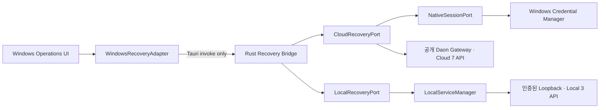

# Daon Windows Recovery Adapter 보정 설계

## 1. 문서 정보

| 항목 | 내용 |
| --- | --- |
| 문서 ID | `DAON-WINDOWS-RECOVERY-ADAPTER-DESIGN` |
| 버전 | `1.3` |
| 작성일 | 2026-08-10 |
| 상태 | 신산님 승인 · Native Recovery 권한 Projection·로그인 UI 보정 반영 |
| 승인 결정 | 신산님 2026-08-10 · Tauri Native Bridge 안 승인 / 2026-08-11 · Cloud 7·Local 3 전용 Command 보정 승인 / 2026-08-11 · Recovery 최소 권한 Projection·Windows 로그인 UI 승인 |
| 상위 설계 | `docs/superpowers/specs/2026-07-20-daon-user-program-design.md` 0.9 |
| 상위 계획 | `docs/02_work_orders/daon_user_program_release_1_implementation_plan.md` 1.8 · R1-M5-07 |
| 공개 계약 승인 | `APR-R1-M5-07-RECOVERY-API-20260731-01` |
| Native 로그인 승인 | `APR-R1-M5-07-WINDOWS-NATIVE-LOGIN-20260810-01` |

## 2. 배경과 문제

R1-M5-07은 Cloud Backup·Restore 공개 API 7종과 Windows Local Recovery Loopback API 3종을 구현했다. Web은 same-origin Adapter가 연결됐지만 Windows `desktop-shell.jsx`는 공용 `OperationsRecoveryWorkspace`에 `recoveryAdapter`를 전달하지 않는다. Tauri command도 Local Service 상태·재시도만 노출하므로 Windows 화면에서는 실제 Cloud Backup·Restore와 Local Recovery를 실행·관찰할 수 없다.

복원 승인된 lifecycle host와 오류 fixture는 Windows Local Service의 실행·회귀에 필요하지만 Adapter 연결 자체를 대신하지 않는다.

## 3. 목표와 비목표

### 목표

- Windows React 화면이 Browser Fetch 없이 Tauri Native Bridge로 Recovery 기능을 사용한다.
- Cloud 7종은 공개 Gateway 계약, Local 3종은 인증된 Loopback 계약을 그대로 유지한다.
- Token·Credential·내부 Endpoint를 JavaScript·Log·Evidence에 노출하지 않는다.
- 실제 권한·Step-up·Fixture Allowlist·Retention·Audit 검증을 서버 또는 Local Service 정본에서 수행한다.
- Adapter가 없거나 Session·Local Service가 준비되지 않으면 안전하게 실패하고 Prototype 성공으로 대체하지 않는다.

### 비목표

- 새 공개 Cloud/Local API 추가
- Web BFF를 Windows에서 직접 호출
- Local Service가 Cloud 7종을 대리하도록 Local 공개 계약 확대
- 운영 데이터 Restore, 제자리 덮어쓰기, 파괴적 손상 주입
- G9-DRILL 없는 실제 운영 Restore
- Windows Account 전체 UI 재설계

## 4. 검토한 접근

### A. Tauri Native Bridge — 채택

React는 Tauri `invoke`만 호출한다. Rust Bridge가 Cloud Gateway와 Local Loopback을 각각 올바른 보안 Context로 호출한다. WebView CSP `connect-src 'none'`을 유지하고 Credential은 Native 경계를 넘지 않는다.

### B. Local Service가 Cloud API까지 대리 — 기각

Local 공개 계약을 승인된 3종보다 확대하고 Local-private와 Cloud-sync 책임을 결합한다. R1-D027 및 App→Service 경계를 불필요하게 변경한다.

### C. Desktop WebView가 Web BFF 직접 호출 — 기각

Web용 Cookie·same-origin 경계를 Native에 재사용하게 되고 CSP 완화와 Endpoint 노출이 필요하다. Browser와 Native Credential 의미가 섞이므로 채택하지 않는다.

## 5. 확정 구조

### 5.1 WindowsRecoveryAdapter

`apps/desktop/src/windows-recovery-adapter.js`가 공용 UI가 요구하는 Adapter 계약을 구현한다.

- Cloud: `listBackups`, `createBackup`, `getBackup`, `previewRestore`, `getRestore`, `executeRestore`, `cancelRestore`
- Local: `startRecoveryScan`, `getRecoveryJob`, `repairRecoveryJob`
- 모든 호출은 Tauri command 이름과 직렬화 가능한 DTO만 사용한다.
- URL, Authorization Header, Cookie, Token, 내부 Port를 JavaScript에 전달하지 않는다.
- Rust의 Safe Error만 `{ code, trace_id, retryable }`로 투영한다.

### 5.2 Rust Recovery Bridge

`apps/desktop/src-tauri/src/recovery_bridge.rs`가 Tauri command와 두 Port를 소유한다.

- Command 입력은 허용 필드, 크기, ID 형식, Workspace 범위를 검증한다.
- Command별 Capability Allowlist를 고정한다.
- Cloud와 Local 호출은 서로 다른 Client·Credential·Timeout·Audit Context를 사용한다.
- 응답은 승인된 API DTO만 반환하고 Header·Credential·내부 URL을 제거한다.
- 실행 중 상태가 바뀌면 각 요청에서 Session·Workspace·Step-up을 다시 검증한다.

### 5.2.1 NativeRecoveryRuntime과 전용 Tauri Command

실제 코드에는 CloudRecoveryPort·LocalRecoveryPort만 있고 React가 호출할 Recovery Tauri Command가 없으므로, Windows React Adapter보다 먼저 Native Command Surface를 보정한다.

- `NativeRecoveryRuntime`은 앱 수명주기 동안 고정 `NativeCloudRecoveryClient`와 Cloud Idempotency·Step-up 소비 이력을 소유한다. Command 호출마다 Port를 새로 만들어 소비 이력을 초기화하지 않는다.
- `NativeSessionRuntime`과 `LocalServiceManager`는 기존 Tauri State를 그대로 재사용하며 Credential·Gateway·Loopback Port·App Instance Secret은 JavaScript에 반환하지 않는다.
- 범용 `method/path/body` Command는 만들지 않고 다음 10개 전용 Command만 등록한다.
  - `recovery_cloud_create_backup`
  - `recovery_cloud_list_backups`
  - `recovery_cloud_get_backup`
  - `recovery_cloud_preview_restore`
  - `recovery_cloud_get_restore`
  - `recovery_cloud_execute_restore`
  - `recovery_cloud_cancel_restore`
  - `recovery_local_start_scan`
  - `recovery_local_get_job`
  - `recovery_local_repair_job`
- 각 Command 입력은 `#[serde(deny_unknown_fields)]` 전용 DTO로 역직렬화하고, Rust가 승인된 Method·Path·Body·Query·Header 의미를 내부에서 조립한다. JavaScript는 Method·Path·Gateway·Authorization을 지정하지 못한다.
- Cloud Write의 Idempotency·Step-up·If-Match 원문은 요청 수명 동안 Zeroizing 소유자에만 존재하고, 사용 이력에는 SHA-256 Digest만 제한 LRU로 보존한다.
- Command 반환은 `CloudRecoveryProjection`, `LocalRecoveryJob`, `LocalRecoveryError`의 Safe 직렬화 계약만 사용한다. Unknown field·Unknown Error·내부 Context 반사는 `*_RESPONSE_REJECTED` 또는 승인 Safe Error로 닫는다.
- `lib.rs`의 `generate_handler!` 등록과 `app.manage(NativeRecoveryRuntime)` 초기화가 일치하지 않으면 Build/Test에서 실패해야 한다.

### 5.3 CloudRecoveryPort

- 승인된 Cloud 7개 Method·Path만 호출한다.
- API 주소는 서명·패키징된 Native 공개 Gateway 설정에서 읽는다. `.env`, `NEXT_PUBLIC_*`, Docker 내부 Host, `localhost`를 사용하지 않는다.
- Native opaque access/refresh는 M4 Identity 계약을 사용한다.
- Credential은 Local Storage Root Key와 분리된 Windows Credential Manager Target에 저장한다.
- Access 만료 시 Native Session 계층에서 1회 회전한다. Replay·철회·실패 시 `AUTHENTICATION_REQUIRED`로 닫고 Recovery 요청을 재실행하지 않는다.
- Step-up ID와 Idempotency Key는 요청별로 전달하되 Log·Evidence에는 원문을 남기지 않는다.
- Native Session 연결이 아직 준비되지 않았으면 Cloud Adapter는 Fixture를 반환하지 않고 `AUTHENTICATION_REQUIRED`를 표시한다.

### 5.3.1 Windows Native 로컬 로그인

- 기존 `POST /api/v1/auth/login`은 Web 전용 Secure·HttpOnly Cookie 계약을 그대로 유지한다.
- Windows 설치형은 별도 `POST /api/v1/auth/native/login`에 `login_id`·`password`만 HTTPS로 전송한다. `platform`, `client_kind`, Tenant·Workspace는 요청에서 받지 않는다.
- 서버는 Platform `windows`, Client Kind `native`를 고정해 Device·Session과 단일 사용 Refresh Family를 만들고, 사용자·Tenant·기본 Workspace·Session·Device ID와 opaque Access·Refresh Credential을 반환한다. 응답 Cookie는 0건이다.
- Rust가 응답을 직접 수신하고 `DaonUser/NativeSession/v1` Windows Credential Manager Target에 저장한다. 기존 `DaonUser/LocalStorage/v1` Root Key Target과 절대 공유하지 않는다.
- JavaScript에는 인증 성공 여부와 Safe Session Projection만 전달하며 Access·Refresh 원문, Authorization Header, Gateway URL은 전달하지 않는다.
- Access 만료 시 Rust는 기존 `POST /api/v1/session/refresh` 회전 계약을 최대 1회 사용한다. Refresh 재사용·철회·회전 실패 시 저장 Credential을 폐기하고 `AUTHENTICATION_REQUIRED`로 닫으며 원 Recovery 요청은 자동 재실행하지 않는다.

### 5.3.2 Recovery 최소 권한 Projection

- Cloud Recovery 7종의 서버 최종 권위는 기존과 동일하게 현재 Workspace의 `Action.POLICY_MANAGE` 판정이다. 별도 Role·Permission 체계를 추가하지 않는다.
- `GET /api/v1/session`은 기존 Safe Session 필드에 `recovery_operations`를 추가한다. 값은 서버가 현재 Principal·Tenant·Workspace·정책 버전으로 평가한 다음 고정 문자열의 정렬된 배열이다.
  - `cloud_backup_create`
  - `cloud_backup_list`
  - `cloud_backup_get`
  - `cloud_restore_preview`
  - `cloud_restore_get`
  - `cloud_restore_execute`
  - `cloud_restore_cancel`
- `POLICY_MANAGE`가 허용되면 7종 전체, 거부되면 빈 배열을 반환한다. 역할·전체 Effective Permission·정책 내부 사유는 JavaScript에 반환하지 않는다.
- Rust는 별도 읽기 전용 Tauri Command `native_recovery_authorization_status`에서 Vault Access를 Rust 내부에서만 사용해 `GET /api/v1/session`을 호출하고, 현재 Native Session 식별자·Workspace와 응답이 정확히 일치할 때만 Safe Projection을 반환한다.
- Projection은 Credential Manager/Vault에 저장하지 않는다. Desktop 시작·로그인 성공·Session 갱신·Operations 진입 시 새로 조회하며, 조회 실패·Unknown field·식별자 불일치·권한 거부는 빈 허용 목록과 Safe Error로 Fail-close한다.
- `recovery_operations`는 버튼 가시성·Handler 사전 차단을 위한 최소 권한 힌트다. Cloud 7 API는 매 요청마다 `POLICY_MANAGE`와 Step-up을 다시 검증하는 최종 권위자로 유지한다.
- Local 3종은 Cloud 권한 Projection에 포함하지 않는다. 기존 `LocalServiceManager` readiness와 고정 Scope·Capability HMAC 검증이 최종 권위다.

### 5.4 LocalRecoveryPort

- `LocalServiceManager`의 동적 Loopback 주소와 App Instance Credential을 Native 내부에서만 사용한다.
- 요청마다 Local Service 정본과 일치하는 Scope·Capability 쌍으로 단기 HMAC Token을 발급한다.
  - Scan: `recovery.write` · `recovery.scan`
  - Job 조회: `recovery.read` · `recovery.job.read`
  - Repair: `recovery.write` · `recovery.repair`
- 현재 Rust Token 발급 Allowlist가 Runtime Read 두 쌍만 허용하므로 위 Recovery 세 쌍을 정확히 추가하고 다른 조합은 계속 거부한다.
- 정확히 다음 3개 계약만 허용한다.
  - `POST /local/v1/recovery/scans`
  - `GET /local/v1/recovery/jobs/{id}`
  - `POST /local/v1/recovery/jobs/{id}/repair`
- Port·Token·Storage Root·격리 경로는 React에 반환하지 않는다.
- Local Service가 `ready`가 아니면 자동으로 Cloud로 전환하지 않고 `LOCAL_SERVICE_UNAVAILABLE`을 표시한다.

### 5.5 UI 연결

- `desktop-shell.jsx`는 WindowsRecoveryAdapter를 한 번 생성해 `OperationsRecoveryWorkspace`에 전달한다.
- 공용 `RecoveryApiPanel`은 Cloud Adapter를 사용하고, Local Recovery는 별도 상태 영역에서 Scan→Job 상태→Repair/Manual 경로를 보여준다.
- Cloud Session 미연결과 Local Service 미준비를 서로 다른 상태로 표시한다.
- 권한이 없거나 Step-up이 없는 버튼은 실행하지 않으며 Safe Error와 Trace만 표시한다.
- Cloud 버튼과 Handler는 `recovery_operations`의 해당 Operation을 이중 확인하며, 미허용 Operation은 Tauri Recovery invoke 0건이다.
- Windows 최초 실행에는 실제 Native 로그인·로그아웃 UI를 제공한다. Login ID와 Password는 제출 수명에만 존재하고 React 지속 State·Storage·Log·Error에 보존하지 않는다.
- 로그인 성공 시 Safe Session과 최신 Recovery 권한 Projection으로 Operations Tree를 재생성한다. 로그인 실패·권한 Projection 실패 시 Cloud Recovery invoke는 0건이다.
- Prototype Fixture와 실제 Adapter 결과를 혼합하지 않는다.

## 6. 데이터 흐름

### Cloud 목록

1. UI가 `listBackups(workspaceId)`를 호출한다.
2. Adapter가 Tauri `recovery_cloud_list_backups`를 호출한다.
3. Rust가 Native Session·Workspace를 확인한다.
4. CloudRecoveryPort가 공개 Gateway의 승인 Path를 호출한다.
5. Rust가 응답을 Safe DTO로 줄여 UI에 반환한다.

### Cloud Restore Preview·Execute

1. Preview 요청은 현재 Session·권한·Step-up·Fixture 목적지를 서버에서 재검증한다.
2. Execute는 Preview와 다른 새 Step-up 및 최신 ETag를 요구한다.
3. `If-Match`·Idempotency Key를 Native Client가 전달한다.
4. 서버가 허용하지 않으면 상태를 변경하지 않고 Safe Error를 반환한다.

### Local 복구

1. UI가 Scan을 요청한다.
2. Rust가 Local Service `ready`와 App Instance를 확인하고 단기 Token을 만든다.
3. Local Service가 격리 Scan을 수행하고 Job ID를 반환한다.
4. UI는 Job 상태를 조회한다.
5. `repairable`일 때만 Repair를 허용한다. 그 외는 `manual_recovery_required` 또는 실패 상태를 표시한다.

## 7. 오류·보안 계약

| 조건 | 결과 |
| --- | --- |
| Native Session 없음·만료·철회 | `AUTHENTICATION_REQUIRED`, Cloud 요청 0건 또는 재실행 0건 |
| 권한 Projection 없음·거부·불일치 | 빈 `recovery_operations`, Cloud Recovery Tauri invoke 0건 |
| Local Service 미준비 | `LOCAL_SERVICE_UNAVAILABLE`, Cloud 자동 전환 0건 |
| 잘못된 Command·Path·Capability | `LOCAL_COMMAND_NOT_ALLOWED`, Local 요청 0건 |
| Step-up 없음·불일치 | `STEP_UP_REQUIRED`, Restore 상태 변경 0건 |
| Fixture Allowlist 밖 Restore | `RESTORE_DESTINATION_NOT_ALLOWED`, 실제 효과 0건 |
| ETag 충돌 | `PRECONDITION_FAILED`, 자동 Execute 재시도 0건 |
| Token·Header·내부 URL | UI·Log·Evidence 노출 0건 |
| 운영 대상·파괴 요청 | G9-DRILL 없으면 Fail-close |

## 8. 구현 단계

1. TDD로 `NativeRecoveryRuntime`과 전용 Tauri Command 10개의 Allowlist·입력 경계·Credential 비노출·상태 지속을 고정한다.
2. TDD로 JavaScript Adapter의 Command·DTO·Safe Error 계약을 고정한다.
3. LocalRecoveryPort를 기존 Local Service 3개 API에 연결한다.
4. NativeSessionPort와 CloudRecoveryPort를 기존 M4 Native Identity·Cloud 7 API에 연결한다.
5. 서버 Session과 Rust Native Session에 Recovery 최소 권한 Projection을 연결하고 Vault 비저장·현재 Session 일치·빈 목록 Fail-close를 고정한다.
6. JavaScript Adapter의 Command·DTO·Safe Error 계약, Native 로그인 UI와 권한별 Handler 차단을 고정하고 Desktop Shell·공용 Operations UI에 주입한다.
7. Unit·Contract·Rust·Local Service·Desktop Build 회귀 후 NSIS 설치형에서 실제 화면을 검증한다.

## 9. 테스트 계약

### RED 필수 사례

- Adapter가 없는 현재 Desktop에서 실제 API 미연결을 재현한다.
- 잘못된 Command·Path·Workspace·Job ID·DTO를 거부한다.
- Session 없음·만료·Refresh replay에서 Cloud 요청을 만들지 않는다.
- 권한 Projection 없음·거부·Unknown field·Session/Workspace 불일치에서 Cloud Recovery Tauri invoke를 만들지 않는다.
- 로그인 응답과 Session Projection의 Unknown·Credential 유사 필드를 거부하고 Password를 State·Storage·Log에 남기지 않는다.
- Local Service 미준비·위조 Token·Capability 불일치에서 Local 요청을 만들지 않는다.
- Preview Step-up을 Execute에 재사용하지 못한다.
- Fixture Allowlist 밖 목적지와 운영 대상 Restore를 거부한다.
- Token·Credential·내부 URL이 DTO·Log·Debug·Evidence에 나타나지 않는다.

### GREEN·회귀

- Desktop JavaScript Adapter Unit/Contract
- Windows Rust Unit/Contract
- Local Service Recovery 3 API Test
- Cloud Recovery 7 API·OpenAPI 회귀
- 복원된 Local Service lifecycle Node 10건·Rust 20건
- Desktop CSP `connect-src 'none'` 유지
- NSIS Build·설치·실행·종료와 Process/Port 잔여 0건
- 실제 Fixture 화면에서 Cloud 목록·Preview와 Local Scan·Job·Repair 상태 확인

## 10. 완료 판정 경계

- 코드·자동 테스트 통과만으로 Windows 제품 PASS를 주장하지 않는다.
- Windows 설치형 실제 화면/API·Process·Port·Trace/Audit 증거가 있어야 Windows 여정을 PASS로 판정한다.
- 운영 Restore와 파괴적 복구는 G9-DRILL 전까지 계속 금지한다.
- Browser Network same-origin 미증명은 본 Native Adapter 작업으로 해소되지 않으며 별도 검증 부채로 유지한다.
